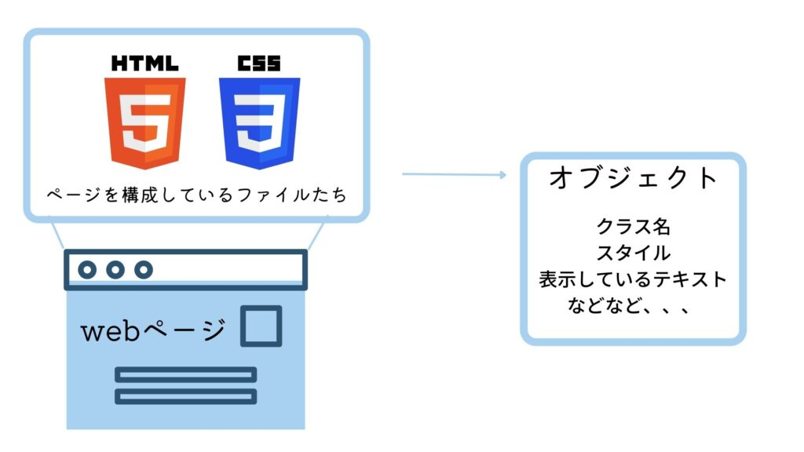

## 先に結論

**DOM操作とは、web上のテキストデータをオブジェクトにしたものを、さまざまな関数によって操作していくこと。イベントハンドラやdocumentを用いて動的なページを作れるようになる。**

こんにちは！

今回は、DOM操作をするための基礎知識を紹介していこうと思います。

JavaScriptでは、大体の人が学習するDOM操作。

一体何者なのでしょうか？。。。

それでは見ていきましょう！

## そもそもDOMってなんなの？

まず、DOMってなんなのでしょうか。。。

公式ドキュメントによると、

> **Document Object Model** (**DOM**) は、ウェブ上の文書のコンテンツと構造からなるオブジェクトのデータ表現です。
> 
>   
> [https://developer.mozilla.org/ja/docs/Web/API/Document\_Object\_Model/Introduction](https://developer.mozilla.org/ja/docs/Web/API/Document_Object_Model/Introduction)

噛み砕いて説明すると、

web上で表示されているhtmlやcssが、JavaScriptのデータとなって作られている。

といったところでしょうか。

イラストにすると、こんな感じです！

上の「オブジェクト」と書かれている部分が、DOMです！

- htmlで書いたクラス
- 表示しているテキスト
- cssのスタイル

などなど、表示しているデータ（静的データ）のさまざまな情報が格納されているのです。

そしてこのDOM、実はあるオブジェクトの中に格納されているのです。。。

それが、windowオブジェクト。

windowオブジェクトは、ブラウザでタブごとに生成されるオブジェクトのことで、

ブラウザのタブについてのさまざまな情報が格納されています。

windowオブジェクトでは次のような操作ができます！

- プロパティを用いてタブの状況（サイズやタブ名など）を観察
- メソッドを用いてタブを操作できる（指定の文字列検索やメッセージの表示など）

具体的な操作については、こちらで確認できます。

https://developer.mozilla.org/ja/docs/Web/API/Window

ブラウザ上でのwindowオブジェクトの包含関係を書いてみました！

DOM：ページごと

Window：タブごと

といった意識で大丈夫です！

それぞれのタブには違ったwindowオブジェクトが作られていて、その中にDOMが格納されているのです！

## DOMの活用法

DOMがどんなものであるかが把握できたところで、基本的なDOM操作について紹介しようと思います！

DOM操作では、次のような使い方をします。

１：プロパティからhtmlのデータを参照

- document.body : htmlのbody要素を取得
- document.head : htmlのhead要素を取得
- document.links : 文書内のリンクのリストを取得

２：メソッドを用いて要素の状態を監視

- document.hasFocus()：指定した要素が画面に表示されているかを返す
- document.write()：指定した要素にテキストを書き込む

## まとめ

windowオブジェクトやDOMを用いることで、動的なページを作ることができるのですね！

最後まで読んでいただき、ありがとうございました！
