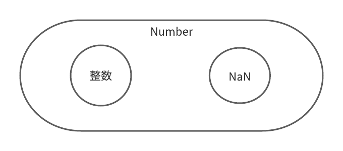
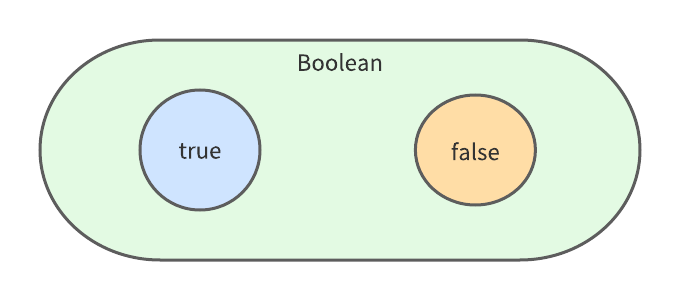
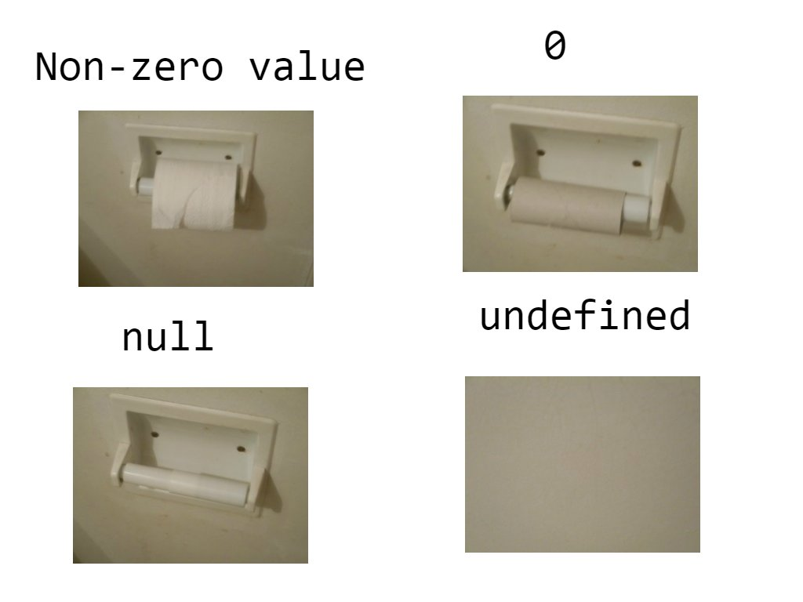

今回は、JavaScriptを書く上で知っていてほしい基礎知識についてまとめました！

多言語から入門する方や、ブランクがある方の役に立てると思います(^^)

それでは、いってらっしゃい！

## データの型 種類

JavaScriptにはさまざまなデータの方があります。

基本的なデータの方は以下の通りです！

### String(文字列)

Stringは、シンプルに文字を表すデータ型です！

単語や文章が入ることが多いですね！

特徴は、クォーテーションで囲む必要があること。

'(シングルクォーテーション)と"(ダブルクォーテーション)の二つがありますが、使い方に大きな違いはありません！

自分でどちらかに統一するようにしましょう！

```
console.log("ヒロケイ")
//ヒロケイ

const name = "hiro"

console.log(`${name} kei`);/* バックティックで連結可能(テンプレートリテラル) */
//hiro kei
```

### Number(数値)

Numberは、数値を表すデータ型です。

正の数、負の数、少数などの実数を表すことができます。

特徴としては、演算が可能な点です。

```
//和(＋)
console.log(5 + 3);
// 8

//差(-)
console.log(5.8 - 3.1);
//2.6999999999999997

//積(*)
console.log(4 * -8);
//-32

//剰余(**)
console.log(10 ** 2);
//100

//商(/)
console.log(9 * 4);
//2.25

//剰余(%)
console.log(10 % 6);
//4
```

（+や\*といった記号は演算子と言われています！）

ここで、0/0といったあり得ない計算を書くとどうなるのでしょうか？

分母に0が来ることはあり得ないという数学的な性質があるのですが、実行してみると...

```
console.log(0/0);
//NaN
```

NaNというものが出力されました！

NaNとは、Not a Numberの略で、数値ではないことを意味しています！

これでも、一応NaNの仲間なんですよw

ちょっと面倒臭いですね。



### Boolean(真偽値)

Booleanは、真偽値を意味します！

真（true）か、偽（false）のどちらかで表現しますよ!



正しいか間違っているか、とってもシンプルですね！

```
// ===は、両辺が等しいかを調べる演算子
console.log(4 === 4);
//true

console.log(3 === 4);
//false
```

### Null(なし)

Nullは、具体的なデータ型がない状態を指します！

少し難しいですよね💦

例文を見てください。

```
let name = null;
//この時点では、空のデータ（null）

name = 'hirokei';
//空だったデータに、String型のデータを代入

console.log(name);
//hirokei
```

変数を定義した時点では、nullという空のデータが代入されていますね！

定義した後に、文字列のhirokeiを代入することによってString型になっています！

### Undefined(そもそも存在してない)

最後に紹介するのが、undefinedです！

簡単に言うとundefinedは、「存在していない」状態のデータ型ですね！

例文を見てください！

```
let name;
//何も代入しないで変数を定義

console.log(name);
//undefined
```

nameを何も代入せずに定義し、出力するとundefinedが表示されていますね！

nullととても似ていますよねw

トイレットペーパーを例に考えるとわかりやすいですよ！


