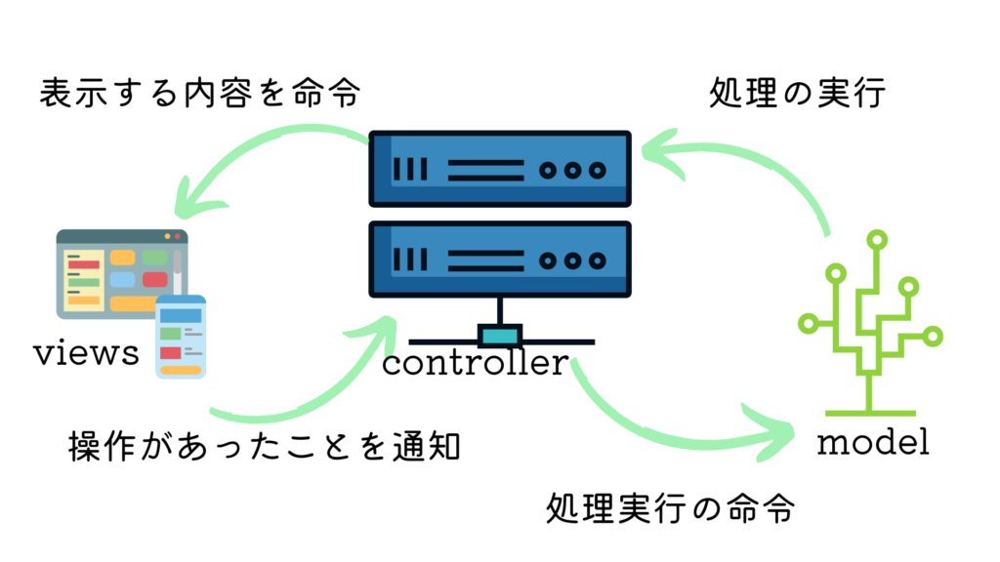

今回は、ファイルを分割してコードを書いていくメリットについて紹介します！

- なぜファイルを分割していくのか？
- どんな基準で分割していけば良いの？

こういった疑問の答えが見つかります！

それでは、いってらっしゃい！

## メリット１：コードが見やすくなる

これが一番大きなメリットでしょう！

大きなファイルを機能によって分割することで、１ファイルのコード量が少なくなります。

コードの量が減ることによって、どんな機能なのかを理解しやすくなりますね！

シンプルで読みやすいので、機能を把握しやすくなりますよ！

## メリット２：バグを見つけやすい

エラー文は、起きている場所を示してくれていることが多いですよね！

ファイルやディレクトリを分割しておけば、エラー場所が具体的になります。

その結果、エラーやバグを発見しやすくなるのです！

## ファイルを分割する方法、考え方【MVCデザインパターン】

では、ファイル分割はどのようにしていけば良いのでしょう？

その答えは、MVCデザインパターンにあります。

機能別にフォルダを分けていくのですが、そのテンプレだと思ってください！

詳しく紹介していきますね！

MVCとは、モデル（Model）ビュー（View）コントローラー（Controller）の頭文字から由来していています。

これら三つの要素が機能の目印になってきます。

#### Model（バックエンド）

モデルフォルダは、データベースの接続や指示があったときに使う関数などの機能を格納しておきます！

具体的には、

- データベースと接続
- mongooseでのスキーマ定義
- データを追加する作業
- データを読み込む作業
- データを更新する作業
- データを削除する作業
- データの形がスキーマと適合するか、検証

などなど。。。

バックエンドとなる部分ですね！

実際には、「models」フォルダと命名されることが多いですね！

#### View(フロントエンド)

ビューは、ユーザーに表示するファイルなどを表示していきます！

ユーザーとプログラムをつなぐ部分といったところでしょうか。

具体的には、

- html(webページの構造を構築)
- css(色や大きななどのスタイリング)
- javascript(特定の操作があったときに動くプログラム)
- UIViewController(iosアプリのUIを構築)

いわゆるフロントエンドと言われる部分ですね！

実際には、「views」フォルダと命名されることが多いですね！

#### Controller(バックエンド)

コントローラーフォルダは、ユーザーの操作に関する処理を格納していきます！

Viewフォルダから送られてきたボタンの信号などから、特定の処理を実行する命令を出します。

具体的には、

- サーバーの構築
- ミドルウェア関数の設定
- ルーティング処理の設定

などなど。。。

ViewとModelを繋ぐ役割といったところでしょうか。

実際には、「controllers」フォルダと命名されることが多いですね！

これらはあくまで軸の考え方です！全く同じファイル形式にしなければならない訳ではないので、状況に応じて分かりやすい形式にして大丈夫ですからよ(^^)

自分の実装したい機能がどの部分なのかを考えながら分割していきたいですね！
