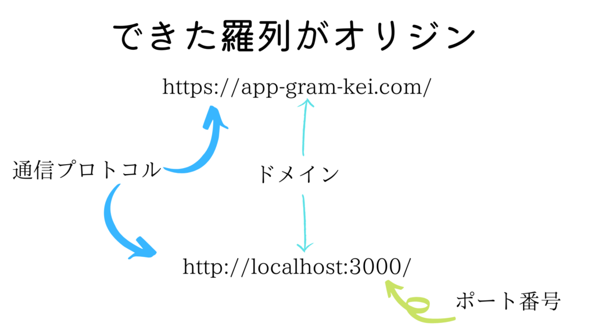
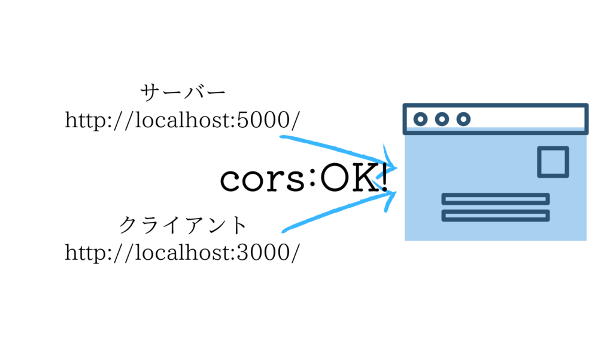

cors(オリジン間リソース共有)

フロントエンド側とバックエンド側で分かれて開発するときに必要不可欠な cors ですが、なんとなくの理解で進んでしまっていました。

今日でロジックを定着しておきたいと思い、まとめていこうと思います。

### まず、オリジンとは？？

曖昧な理解で飛ばされがちなオリジン間リソース共有ですが、そもそもオリジンとはなんなのでしょうか？？

オリジンはURLと似ています

当ブログのURLを例に見ていきましょう！

https://app-gram-kei.com

まず、ドメインはご存知ですか？webページの住所だと思ってくれれば大丈夫です！

このURLでのドメインは、「app-gram-kei」の部分です。

では、「https://」という部分はなんというのでしょうか？

この部分はプロトコルと呼ばれていて、通信のルールを意味しています

このプロトコルとドメインをつなげてできた羅列が、オリジンと呼ばれているものです！

開発を進めていく中でポート番号（3000番とか8000番とか）を指定していきますが、それも含めてまとめてオリジンと呼ぶそうです！



### （本題）オリジン間リソース共有とは？？

さて、本題に入りましょうか。。。

オリジン間リソース共有とは、異なったオリジンから送られてきた情報を許可するための仕組みなんです！

node.jsを用いた開発を例に考えて見ましょう！

フロントエンドはreact、バックエンドはexpressを用いて開発する場合、フロントエンドとバックエンドでは異なったnodeプロセスが動いている必要があります！

ポート番号を揃えてしまうと、どちらか後に実行されるプロセスにエラーが生じてしまいますよね！

フロント：ポート番号3000

バック：ポート番号5000

ポート番号が異なると、オリジンも異なることはわかりますでしょうか？

一つのwebページで複数のオリジンを使うのは基本的にNGなのですが、corsを使うことによって使う許可を得られるのです！



npmを使って

```
npm i cors
```

インストールをし、expressのミドルウェア関数に

```
app.use(cors());
```

と入力すれば、異なるオリジンでもフロントとバックで情報を共有できるようになるのです！
