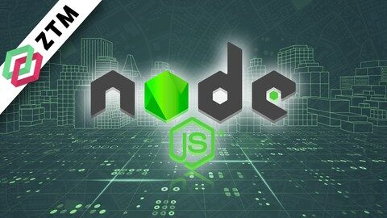

こんにちは！今日は2022/05/05。

だんだん暑くなってきましたね！汗対策が必要になってきましたよ💦

私は先日、web系自社開発企業にインターン生として採用していただくことになりました(^^)

今回の話ですが、私が完全独学でエンジニアインターンに採用されるまでに学んだことを話していきたいと思います！

- 具体的にどんな技術を学習すれば良いのか分からない！

- どのくらいのレベルまで学習すれば良いの？

- 独学で学習するのに、何か気をつけるべきことはある？

こんな疑問を持つ方の参考になる内容です！よろしくお願いします(^^)

## 概略

### When : 完全未経験から採用されるまでの日数

613日かかりました。

1年と8ヶ月くらいですね！

今になって思えば、ビジョンや道筋がはっきりしていて、正しい方法で学習すれば1年でもいける気がします。

### What : 何の技術を学んだか

主に３分野で以下の言語を学習していました！

Rubyに関しては本当に触り程度しか学習していませんでした。。。w

Web系：HTML, CSS, JS, Ruby

iOS : Swift

データ分析、機械学習：Python

### Why : なぜプログラミングを学習したのか？そしてインターンを目指したか？

高校の頃、何となく「クリエイティブな職について楽しく仕事したい」という願望があったのですw

何となくYoutubeを見ていると、こんな動画が目に止まりました。

https://www.youtube.com/watch?v=DYX5yNk3HyM&t=821s

この動画を見て、自分の身につけたスキルでお金を稼ぐ像がすごくかっこよく見えたんです！

なんか、スターウォーズのマンダロリアンみたいでかっこよくないですか？w

「自分もスキル身につけて、必要とされる人になりたい！」と思うようになり、学生のうちに実務経験を積もう！と決めました。

### Who : 誰と勉強してきたか？

完全に一人で黙々と勉強してましたw

周りには同じ志を持った人がおらず、黙々と一人で学習しましたよ💦

### Where : どんな場所で勉強してたの？

- 家

- 大学の自習室

- 近くの図書館

シンプルに上記の場所で学習していました！

気分によって、家で大きなディスプレイを使って学習したり、自習室で黙々と勉強したり、散歩がてら図書館まで歩いて勉強しに行ったり。。。

お金だけはかなりきつかったので、カフェでは勉強しませんでしたね。

## 詳しい内容

筆者の体験談（苦労話）をじっくり語る内容となっています。

ご了承ください。。。💦

### 完全独学、修行の日々

※これから紹介する教材やリンクは、すべて実際に学習してきたものです。

案件でも広告でもないこと、ご了承よろしくお願いしますね(^^)

##### 高３夏休み：志望校を断念したことをきっかけに、プログラミングを勉強開始！！

2020年8月16日。

大学の一般入試のために猛勉強をしていた高３の夏、母親から衝撃の言葉を耳にします。

「指定校で安全な大学に行きなさい。コロナで東京なんて行かせられない。」

本気で勉強していたものですから、最初は冗談だと思って聞き流していました。

しかし、何度も同じ言葉を聞くうちに真面目に言っているんだなと感じ始めたのです。

僕は絶対に東京の大学に行きたい。しかし、親は事情を考えて諦めてほしい。

自分と母親が持つ考えのギャップについて理解し始め、泣く泣く志望校を諦めました。

シングルマザーで二人兄弟を大学に進学させる苦労もわかっていたので、浪人はできませんでした。

* * *

中学の部活ではレギュラーも奪われ補欠に堕ちる。

自分の行きたい大学へ行くどころか、受験すらもできない。

一度も何かを成し遂げることができない自分が情けなくなりました。

そこで、「せめて自分の興味のあることで何かを成し遂げよう」と決めました。

この志望校断念事件をきっかけに、プログラミングについて勉強し始めることになります。

##### 高３秋〜高校卒業：プログラミングの魅力を体感するため、広く浅く言語を学び始める

さて、指定校入試での進路が決まり大量に時間ができた僕は、ProgateにてHTML,CSSについて学習し始めました。

https://prog-8.com/

道場含め２、３周した段階で、JSについて学習しました。こちらも2周ほどやった気がします。

* * *

プログラミングについて基本的なことを理解した段階で、次にUdemyにてWeb開発講座を受講し始めました。

https://www.udemy.com/course/web-application-development/

一通りやってみて。。。

Webに関してはサーバーの知識などが全く無かったため、SQLやRailsについてはほとんど理解できませんでした。。。w

* * *

次に流行りのPythonについて触れてみようということで、下記の講座を受講しました。

https://www.udemy.com/course/100-days-of-code

タートルモジュールを使って図形を書いてみたりGUIの作成を通して、オブジェクト指向について学ぶことができましたね(^^)

バグのググり方や、課題に対するアプローチ方法について学ぶこともできましたよ！

また、ライブラリやフレームワークを使ったコーディングについても慣れ始めた時期でした！

* * *

高校を卒業して春休みに入った段階でデータ分析や機械学習について興味を持ち、書籍やUdemyの講座を受講しました。

https://www.udemy.com/course/complete-machine-learning-and-data-science-zero-to-mastery

https://www.amazon.co.jp/Python%E3%81%AB%E3%82%88%E3%82%8B%E3%83%87%E3%83%BC%E3%82%BF%E5%88%86%E6%9E%90%E5%85%A5%E9%96%80-%E7%AC%AC2%E7%89%88-%E2%80%95NumPy%E3%80%81pandas%E3%82%92%E4%BD%BF%E3%81%A3%E3%81%9F%E3%83%87%E3%83%BC%E3%82%BF%E5%87%A6%E7%90%86-Wes-McKinney/dp/487311845X/ref=sr\_1\_20?\_\_mk\_ja\_JP=%E3%82%AB%E3%82%BF%E3%82%AB%E3%83%8A&crid=1R75TMY9VPXGY&keywords=%E3%83%87%E3%83%BC%E3%82%BF%E5%88%86%E6%9E%90&qid=1651748179&sprefix=%E3%83%87%E3%83%BC%E3%82%BF%E5%88%86%E6%9E%90%2Caps%2C286&sr=8-20

ですが、線形代数や統計数学、機械学習のモデルについて基本的な理解ができていなかった自分には難しすぎましたww

「この処理をすることでどんな特徴が現れる」とか、「このデータは、どんなモデルで学習させれば良いのか」といった知識がなかったので、正直つまらなかったですw

* * *

ここまでWeb開発やデータ分析、プログラミングについて幅広く学習したところで、大学に入学することになります。

* * *

##### 大学入学〜１年夏休み：SwiftでのiOS開発を学習！が、なんと。。。

大学入学後はアプリ開発について興味を持ち始め、おしゃれなiOSアプリを作ろうと思いSwiftを学習し始めます。

そして本格的にエンジニアとしてのキャリアをスタートしようとも考えていました。スタート地点はやはり、エンジニアインターンへの参加ですね。

https://www.udemy.com/course/ios-13-app-development-bootcamp

この講座でデータベース（RealmSwift）の操作について知り、基本的な開発について理解し始めました。

この段階で、人生で初めてのポートフォリオ作成に取り掛かることになります。

そこで作成したものがアイデア作成の補助アプリ、「WordingMaker」。

https://github.com/hirokei-camel/WordingMaker

（詳細はリポジトリのREADMEをご覧ください）

０から自分で作品を作れた時の達成感たるや、どんな快感にも負けませんでした。

さぁ、いざApp Storeにリリース！！が、しかし！！

なんとApple Developer プログラムは未成年だと登録できないことが発覚。。。

本当にショックでしたよwww

https://tomorrow63.hatenablog.com/entry/2016/01/07/175644

リリースまで行けず、やむなくこのままエンジニアインターンの求人に応募していくことにしました💦

結果は、、、惨敗。

４社ほど応募し面接までは行けたものの、すべて不採用でしたw

そりゃあそうですよねw 開発に必要なツールを登録する権利すらない人を採用するわけがありません。

そしてSwiftでの求人は母数も少ないため、応募できる会社もなくなり万事休す。。。💦

自分の学習してきたことが無駄と知り、また振り出しに戻ってしまうのでした。

「ここからどうすれば良い？貯金も尽きてきたし、普通にバイトするか？でも、インターンを諦めることだけはしたくない。。。！！」

諦めようとする自分と、続けようとする自分の考えが錯綜し、焦りを感じ始めた時期でしたね。。。

##### 1年秋〜2年春：Node.jsを使ったWeb開発について学習！そして遂に！！

結局、諦めずにインターンのために開発学習を続けようという結論になりました。

次に学習した技術が、Node.jsになります。

https://www.udemy.com/course/the-web-developer-bootcamp

[

参考

Complete NodeJS Developer in 2023 (GraphQL, MongoDB, + more)

Udemy

](https://click.linksynergy.com/deeplink?id=UFVArvevc4I&mid=47984&murl=https%3A%2F%2Fwww.udemy.com%2Fcourse%2Fcomplete-nodejs-developer-zero-to-mastery%2F)

ここではサーバーや、データベースの操作など、既に学んだ内容が含まれていたので、スラスラと理解ができました。

新しくクライアントやRestAPI、ネットワークアーキテクチャについても理解することができ、多言語で学習してきた知識が体系的につながった時期でした。

ここで二つ目のポートフォリオを作成していくことになります。

作成するアプリはSwiftの時と同じコンセプトで、アイデアの制作アプリです。

https://github.com/hirokei-camel/WordMixer

こちらは無事にデプロイまで持っていくことができました(^^)

[http://35.77.212.41:5000/login](http://35.77.212.41:5000/login)

作品自体はしょぼくて、使い物にはならないようなアプリでしたが、知識のアウトプットという意味では大成功でした。

同時に開発の中で思ったことやわかったことをまとめておこうと、ブログを書き始めます。

https://app-gram-kei.com

さぁ、満を辞してインターンの求人に応募して再チャレンジ！！

結果は、、、

一社から採用通知をいただきました！！（現在勤務している会社）

勝敗は、24戦中１勝23敗でした。

諦めさえしなければ、必ず勝てるんだと自信を持つことができるようになりましたよ(^^)

### 独学経験から学んだこと、今から始める人に伝えたいこと

今までの学習経験を経て、学んだことを伝えておこうと思います。

これからエンジニアになるため学習を始める方、もしくは学習中の方には声を大にして伝えたい内容です。。。！！

##### 独学で学習すると回り道をしてしまうリスクがある、だけど。。。

独学で学習をしていると、「自分のやっていることがあっているのか」とか、「学習している内容を把握できているか分からない」と言った不安が出てくるものです。

指導をしてくれるメンターもいなければ、相談できる先輩もいない状態で学習しているといろんな回り道をしてしまうことが多いんですね💦

- 求人数が多い言語を学習すれば良いの？それとも逆に少ない言語を習得した方が、仕事取りやすいのかな？

- 基本文法ばかり学習してて、これで開発なんてできるようになるの？？

- 今学習している言語が将来使われない的な情報を聞いて、他の言語を学習した方が良いのじゃないか？？

こんな不安から、今学習しているものを諦めて、他の分野に移ってしまう現象が多々あることでしょう。（少なくとも自分はそうでした）

しかし！！

分からないことを自分で解決したり、自分で計画を立てて行動した経験というのは、非常に重要なものなんです！！独学で勉強することで、並外れた自走力が手に入るのです！！

自走力は実務に入ったときに必要な力なので、大きなメリットになりますね(^^)

##### ハードに勉強しすぎると、燃え尽きてやめたくなるかも！

学習中にモチベーションが上がってくると、こんなことを考えてしまうかもしれません。

「よし！！じゃあ半年で技術身につけてマッハでエンジニア目指そう！」

ストイックに学習しようとするの、誰しも一度は思ったはず。

スクールに通って指導のもと学習するのなら良いと思いますが、独学でハードに学習すると大抵燃え尽きてしまいます🔥

そしてできない自分が嫌いになり、諦めてしまうなんてことも。。。

独学の場合は、ゆっくり時間をかけて学習することをお勧めしますよ！！

##### 行動する前に「どんなものを作りたいか」を絶対に決めておくべし！！！

自分としては、学習を始める前に何を作りたいのかを決めておくことをお勧めします(^^)

具体的な目標を立てておくことで、勉強することが目的になってしまうことを防ぐことができますよ！

私自信目標を立てずに学習したことで、自分が何をしたいのかを見失ってしまうことがありました。

スキルを身につけて仕事をとるために学習していたはずが、なぜかスキルアップのために勉強するという謎の状況になり、たくさんの時間を無駄にしました。

目標は具体的に決めておくべきですね！そのためにどんな学習が必要か考えてみると、スムーズに学習できると思います！

##### 学習計画は結果から逆算、そして具体的に組む

さぁ、具体的に学習計画を立てよう！というとき、意識すると効率を爆上げできる考え方があります。

それは、結果から逆算することです。

「４月までには求人に応募したい。そのために3月30日までには作品をデプロイをしておこう。そのためには3月18日までに開発を終わらせておきたいから、2月中には基礎的な学習を終わらせておこう。よし、じゃあ今月はこれを学習すれば余裕が出そうだ。今週中はこの辺りまでやっておきたいから、今日はこれとこれをやろう！午前中にはこれを終わらせて、午後は〜をしよう！」

結果から逆算して、その日に決めた目標を徹底的にこなす。そして終わったらあとは自由。遊んでも追加で学習してもOK!!みたいな考えで学習すると、精神的にも楽になりますよ(^^)

##### 一度決めた計画、目標はどんなことがあっても諦めない！！そのために。。。

一度立てた目標やミッションは、絶対諦めずに取り組みましょう。

今日やると決めたことは、今日中に終わらせないと寝ちゃだめ。くらいの気持ちで取り組まないと、怠けた結果が次の日にも響いてしまいます。

そのためにも、計画は現実的、具体的な計画を立てておきたいですね(^^)
