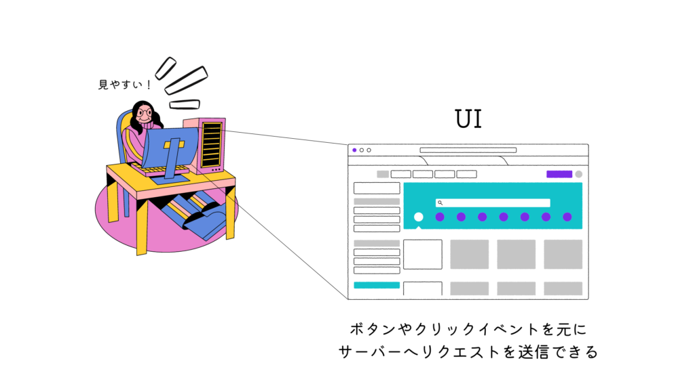

こんにちは！

今回は「JSがどんな順序で読み込まれ、実行されていくのか」をまとめていきたいと思います。

最近、NextJSやSvelteKitに触れる機会が増えてきたので、CSRとSSRの区別をつけるためにも根本の理解は大事です。

そのためには、ブラウザ上でJSがどのように実行されているのかを把握する必要があると思います。

仕組みから理解していき、パフォーマンスを意識した開発ができるようになっていきましょう！

内容が多くなってしまうので、4部構成にして解説していきたいと思います。

**第１章：ブラウザのコンポーネントについて**

**第2章：ファイルの解析、レンダーツリーの構築について**

**第3章：イベントループについて**

**第4章：CSR、SSRなどのレンダリング方式について**

ここでは、詳しい処理を延々と解説するのではなくニュアンスの理解を助けるような内容となっていますので

- 「レンダリングの仕組みがよくわからねぇぜ」
- 「先輩や同僚が話してることが理解できん。。。」

って方の役に立つと思います。

## ブラウザの役割

皆さんが調べ物をしたり、web開発をする際に使用するブラウザ。

ブラウザの仕事は、インターネットを利用して情報を閲覧するためのツールです。

見たいものや調べたいことを検索（リクエスト）すれば、関連したサイトが表示（レスポンス）されたりするのは、容易に想像がつくと思います。

### ブラウザのコンポーネント

そんなブラウザですが、実はいくつかの要素（コンポーネント）に分けることができます。

- UI
- ネットワーク
- JSエンジン
- レンダリングエンジン

一つずつ解説していきます。

#### ユーザーインターフェース（UI）

UIとは、私たちが実際に見ている画面を指します。

表示されているページ、ブラウザバックボタン、タブなどもUIの一部です。

UIの役割としては

- 私たちが操作した内容通りにサーバーへリクエストを送信する
- 表示可能となった情報をユーザーへ表示する

主にこの二つとなります。

#### ネットワーク

ネットワークとは、サーバーと通信して渡されたリソースファイルをレンダリングエンジンに渡す処理をしてくれます。ここでは深く突っ込みません。

レンダリングエンジンについては次に紹介します。

#### レンダリングエンジン

レンダリングエンジンは、画面描画のための準備をしてくれるコンポーネントです。

具体的な役割としては

- サーバーから送られてきたHTMLやCSSを解析して画面に表示する準備をしてくれる
- HTMLやCSSを解析しDOMとCSSOMを生成、レンダーツリーを構築してくれる

DOMとCSSOMの生成などの詳しい流れは次章で解説します。

HTML上にあるscriptタグのコードや、JSファイルが見つかった場合にJSエンジンへ処理を任せるという役割も担っています。

JSエンジンについては次に紹介します。

#### JSエンジン

JSエンジンの役割は以下の通りです。

- JSのコードを読み込んで（解析、コンパイル）実行できるようにする
- 読み込んだJSコードを実行する

読み込みと実行が主な役割ですね。

（解析とコンパイルの詳しい処理は次章で解説します。）

以上がブラウザで使われているコンポーネントです。

大まかな関係図を置いておきます。

### 各ブラウザで使われているコンポーネント

ブラウザを構築していくコンポーネントについて紹介しましたが

実はJSエンジンとレンダリングエンジンについてはブラウザごとに違うエンジンを使っています。。。！

各エンジンの強みとかを調べてみるのも面白いかもしれませんね(^^)

主なブラウザのコンポーネントを軽くまとめておきます。

<table><tbody><tr><td></td><td>レンダリングエンジン</td><td>JSエンジン</td></tr><tr><td>Chrome</td><td>Blink</td><td>V8</td></tr><tr><td>Microsoft Edge</td><td>Blink</td><td>V8</td></tr><tr><td>Safari</td><td>WebKit</td><td>JavaScriptCore</td></tr><tr><td>Firefox</td><td>Gecko</td><td>SpiderMonkey</td></tr></tbody></table>

（自分はV8しか知りませんでした💦）

以上がコンポーネントについて話でした。

次回はレンダリングエンジンでのDOMやCSSOMの生成、JSエンジンにて解析とコンパイルが行われ、レンダリングエンジンがどのように構築されていくのかを解説したいと思います。

最後まで読んでくれてありがとうございました。

一緒に勉強頑張っていきましょう(^^)
