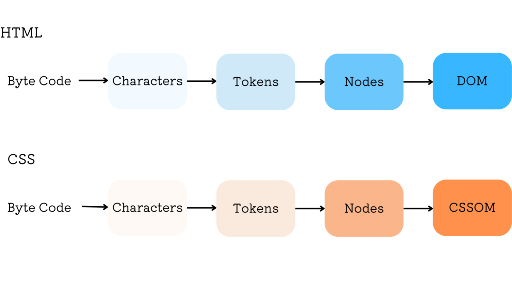
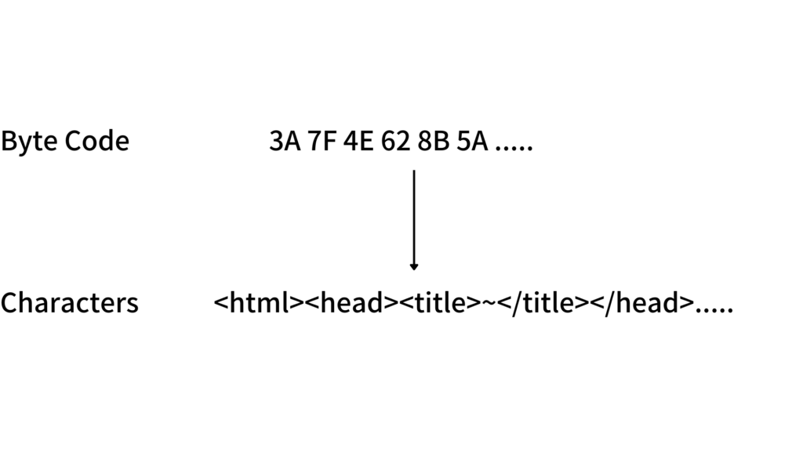
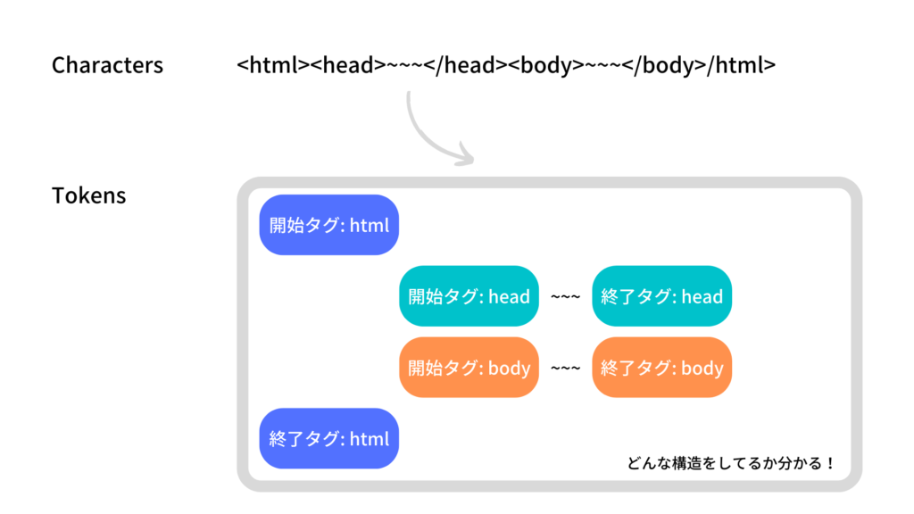
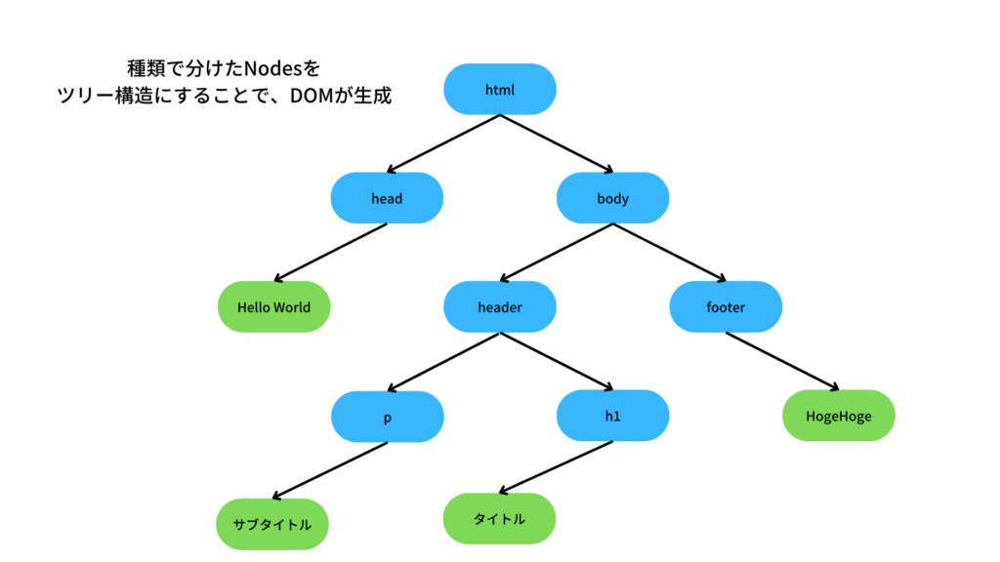
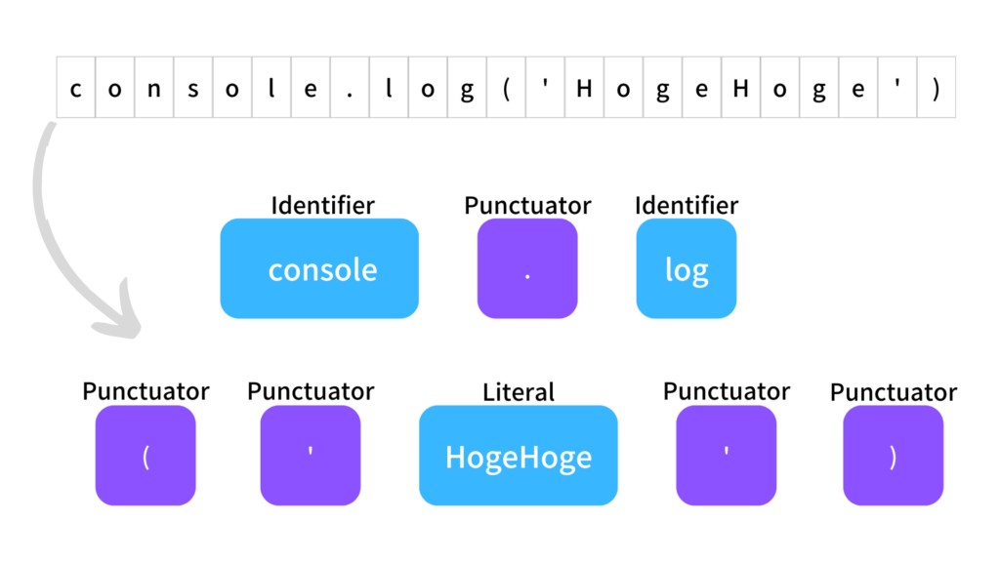
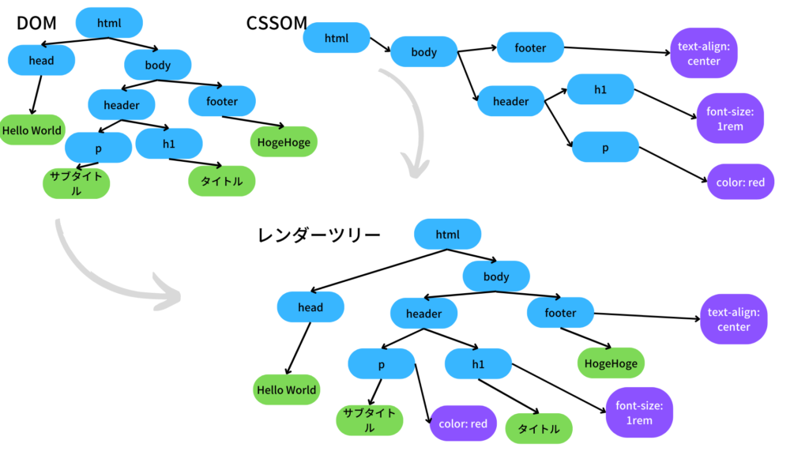

こんにちは。

今回はブラウザ上での処理を覗いてみようということで、ファイルの解析とレンダーツリーの構築についてまとめていきたいと思います。

もうちょっと細かく言うと

- レンダリングエンジンのDOMとCSSOM生成
- JSエンジンの解析、コンパイル
- それらを合わせて構築するレンダーツリー

自分達が作成したコードがどのように実行、描画されていくかをイメージできるかと思います。

この記事は４部編成に分かれています。前回の記事に目を通しておくと理解を助けてくれますので、是非読んでいってくださいね(^^)

https://app-gram-kei.com/?p=198

## 流れ

DOMやCSSOMの生成は、レンダリングエンジンにて行われます。

（前記事より）


この辺の処理を詳しく見ていきましょう。

### HTML, CSSのダウンロード

まず、ネットワークから渡されたHTMLとCSSがダウンロードされます。

### 解析、DOM, CSSOMの生成

ダウンロードされたHTMLは、Byte Codeとしてスタートしていきます。

最終的にDOM, CSSOMへ変換していくわけですが、いくつかの過程を踏んでいきます。

以上の過程を踏んでいきます。詳しく見ていきましょう。



#### Conversion: Byte Code→Characters

まず、ダウンロードしたHTMLは人間が書いたコードではなく、Byte Codeという命令の塊のような形式になっています。

このByte Code を人間が読める形式に加工していきます。

特に意味をなさず、ただの文字列といったニュアンスです。

その際、文字コードという情報に基づいて変換していくことを頭の片隅に置いておくと良いでしょう。



#### Tokenizing: Characters→Tokens

Charactersに変換されたHTMLは、構造的に意味のある情報に変換する必要があります。

そのため、Tokenという塊にまとめていきます。

例えば<から>までの文字は開始タグで、</で始まっているのは終了タグだ。といった具合で塊を作っていきます。

その際、[W3C HTML Standerd](https://html.spec.whatwg.org/multipage/)という解析上の規約があり、そのルールに基づいてTokensに変換していくようです。



#### Lexing: Tokens→Nodes

構造的に意味のあるTokenに変換された次は、DOMを生成するためにオブジェクトへ変換していきます。

Tokenの性質によって様々な種類のNode(オブジェクト)を生成していきます。

DocumentやElementなど、様々な種類のオブジェクトが存在するのですが、[こちら](https://developer.mozilla.org/ja/docs/Web/API/Node)で詳しく確認できます。

#### DOM construction: Nodes→DOM

種類ごとに分けられたNodesから、DOMを構築していきます。

ツリー構造になっているのがポイントですね。



こちらのDOM、JSを使って操作したり参照したりできます。

JSでDOM操作をすることによってDOMが動的になっていくのですね！

CSSOMも同様にして生成されていきます。

以上の解析処理をParseというので、覚えておくと良いかもしれません(^^)

### scriptタグがあった際、記述されたコードをJSエンジンに渡す

HTMLの解析中にscriptタグがあった場合、レンダリングエンジンはJSの解析ができませんので、JSエンジンに処理を任せていきます。

JSエンジンの処理の流れを見ていきましょう！

### JSコードの解析、コンパイル

文字列を出力するコードを例に解説していきます。

```
console.log('HogeHoge');
```

#### 字句解析: コード→Token

渡されたコードを一文字ずつ読み込んでいき、プログラム的に意味のある最小単位に切り分けていきます。

先ほどCharactersからTokensへの変換について解説しましたが、それと似ています。



#### 構文解析: Token→AST

次に、生成したTokenから、抽象構文木（AST）というツリー構造を生成していきます。

DOMと似たもので、コードがどんな構造をしているかを把握できます。

```
console.log('HogeHoge');
```

↓

```
type: Program
-
body
-
#1
type: ExpressionStatement
-
expression
type: CallExpression
-
callee
type: MemberExpression
computed: false
-
object
type: Identifier
name: console
-
property
type: Identifier
name: log
-
arguments
-
#1
type: Literal
value: HogeHoge
raw: 'HogeHoge'
sourceType: script
```

下記のリンクは、ご自身の書いたコードを即座にASTに変換してくれるサイトですので、ぜひご確認ください。（Tokenも確認できます）

https://esprima.org/demo/parse.html?code=%2F%2F%20Life%2C%20Universe%2C%20and%20Everything%0Aconsole.log(%22Hello%20World%20!%22)%3B

（ESLintはASTを経由して構文エラーや警告などを表示してくれるらしいですよ！）

#### コンパイル: AST→Byto Code

生成したASTをコンパイルすることによって、CPUが処理できるようにしていきます。

実はJSエンジンによってコンパイルのタイミングは違います。解析が終わったタイミングでコンパイルするエンジンもあれば、JSを実行するタイミングでコンパイルすることもあります。(現在の段階ではまだ解析が終わった段階。コードの実行はしていない)

最近はJITコンパイルという、中間言語に翻訳して実行時に素早くコンパイルするといった方式が使われているようです。驚き！

#### JSの実行

コンパイルされたJSがCPUにて実行されます。

(実行時の話題として絶対外せないイベントループについては、次の章で解説します)

### 実行したJSの結果とDOM, CSSOMを元にレンダーツリーを構築

最後に、生成したDOMとCSSOMを元に、レンダーツリーを構築していきます。

DOMによる構造的な情報と、CSSOMによる付随的な情報をあわせ、新しいツリー構造を作っていきます。

DOMにCSSOMの情報が加わったというニュアンスで良いと思います。（私はそういう認識です）



以上が画面描画時のレンダリングエンジンとJSエンジンの処理の流れです。

次は、実行されたJSがどのように動いていくのかを解説していきます。イベントループの仕組みを理解することで、JSが超絶強くなる様をみていきましょう(^^)

最後まで読んでくださり、ありがとうございました！
