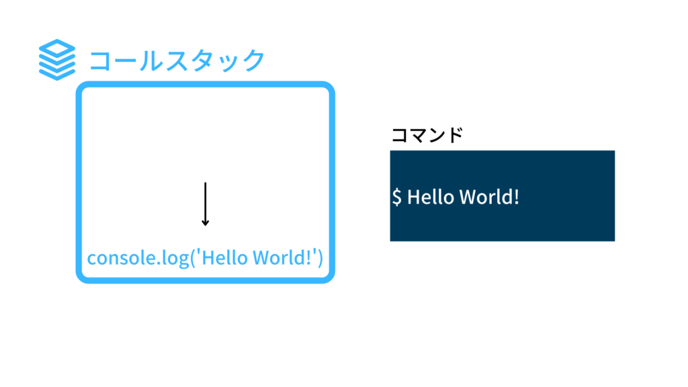
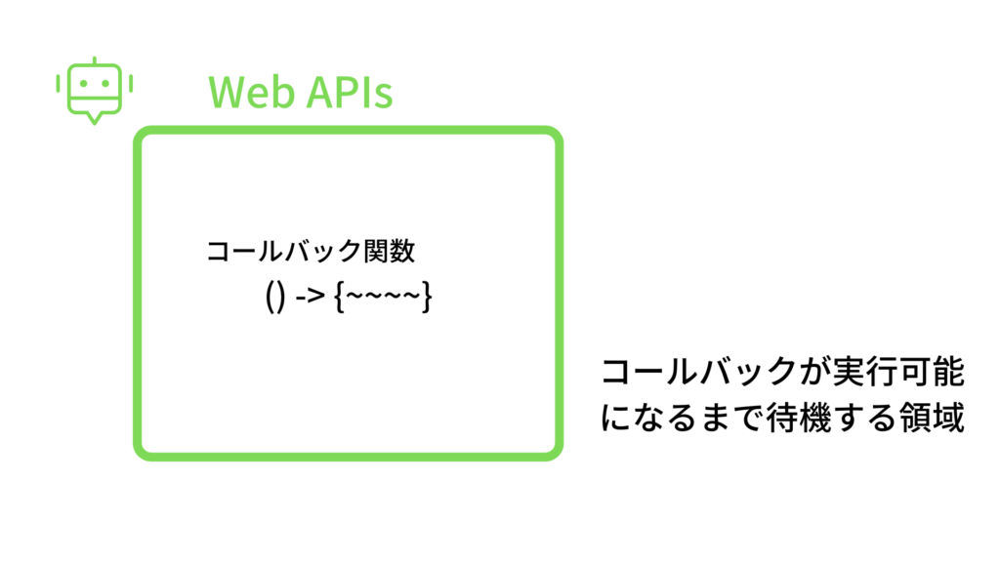
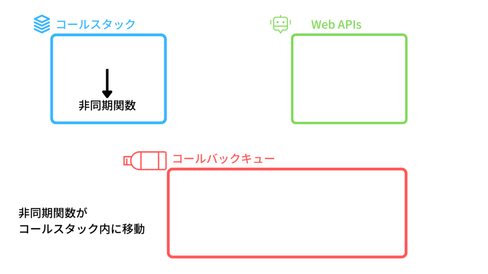
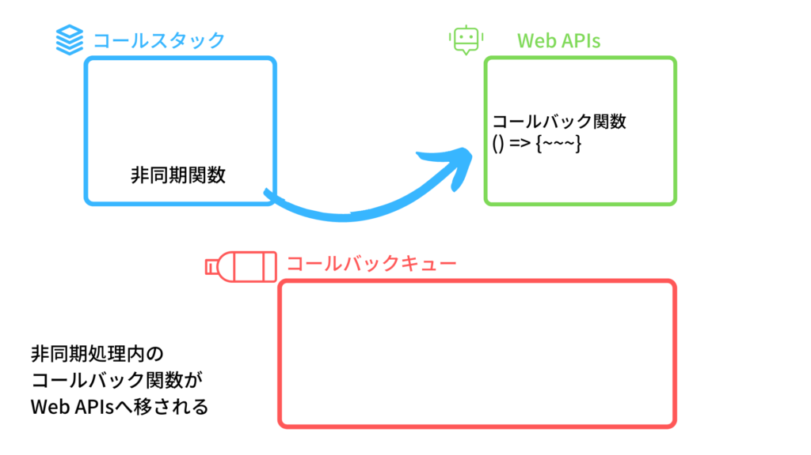
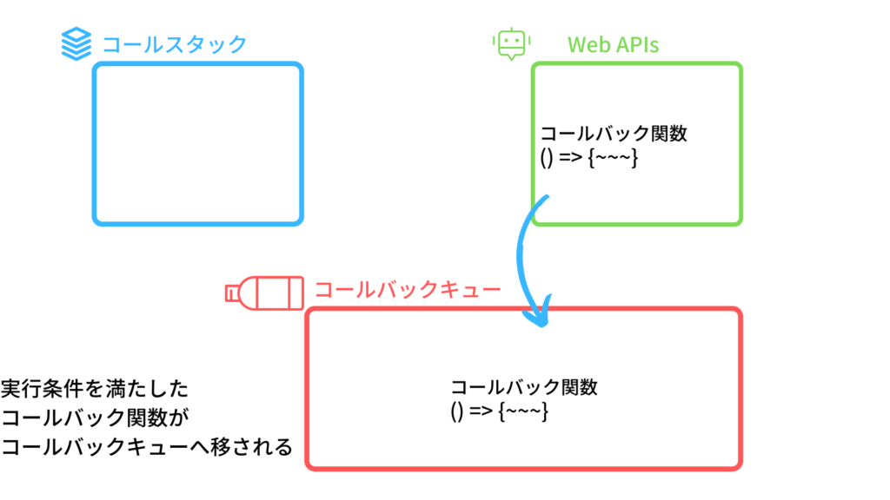
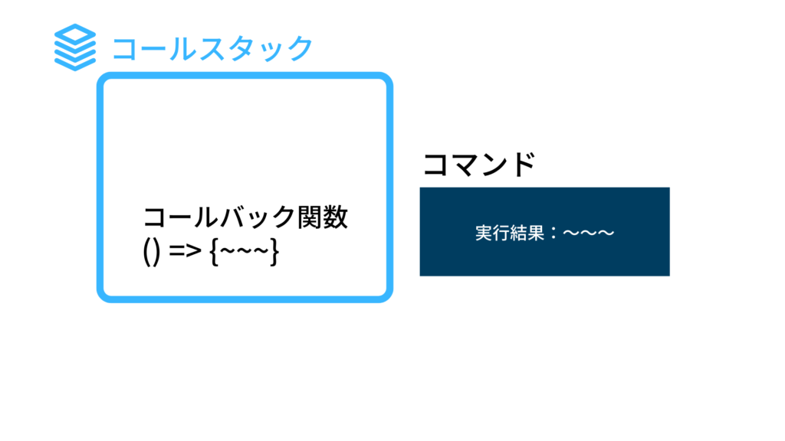
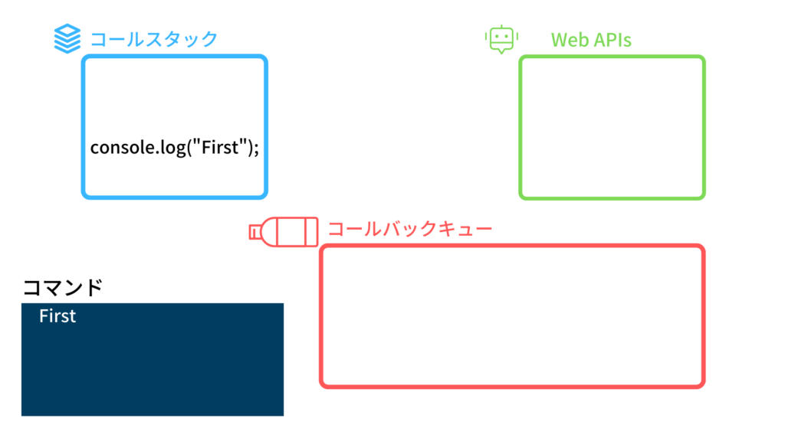
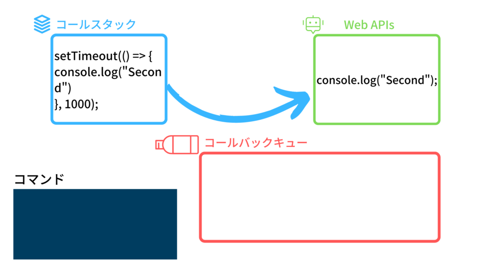
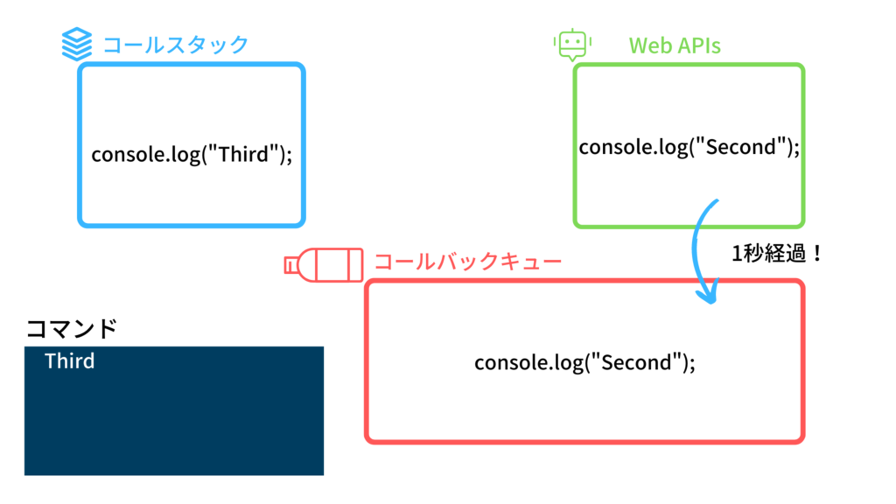

こんにちは、今回はイベントループについて紹介していきたいと思います。

こちらの記事は「JSがブラウザ上でどのように動いているのか」をシリーズ形式にしてお届けしています。

前回までの記事を読むと、理解しやすいかと思いますので是非みていってくださいね！

[第1章 ブラウザのコンポーネント編](https://app-gram-kei.com/?p=198)

[第2章 レンダーツリー構築編](https://app-gram-kei.com/?p=213)

今回は第3章となります。

## JS自体はシングルスレッド

JavaScript自体はシングルスレッドという方式を採用しています。

シングルスレッドとは、一つの処理のみを実行していくスタイルです。

つまり、

複数の処理を同時進行で実行できないのです。

こんな時、次のような問題が起こってしまうのです。

- JSによってバックグラウンドカラーが常に変化する処理を実行しながら、クリックイベントが発生した時の処理を実行することができない。
- 実行に10秒程かかってしまう処理を実行しているので、レンダリングに大幅な遅延が生じてしまう（ブロッキング処理の実行）

こんな事態を避けるため、JSエンジンはイベントループという仕組みを搭載しているのです！

### イベントループによって処理の同時進行が可能に

イベントループとは何なのでしょうか？

簡単に言うと、JSの処理を同時進行で実行することができる仕組みです。


## イベントループ 処理の流れ

イベントループによる処理を実行する中で３つの要素が出てきますので、まずはそれらの役割を見ていきましょう！

### 処理を担う機能たち

#### コールスタック

JSが実行される流れで最初に通るのは、コールスタックという領域です。

関数がどんな順番で実行されているのかを管理するための箇所で、コマンダー的な立ち位置です。



#### Web APIs

非同期処理のコールバック関数が実行可能になるまで定期している領域です。



Web APIs内ではコールバック関数を実際に実行しているわけではないので、ご注意ください。

#### コールバックキュー

実行可能になった非同期処理がスタンバイをする領域です。

コールスタック内で処理が可能になると、実際に実行されていくのですが、詳しい内容に関しては処理の流れで解説します。


以上の要素がイベントループを実行するための要素です。

### 1: 非同期関数を実行、コールスタックへ移動

まず、JSが実行される際にコールスタックへと移動されます。

ここでは、同期関数と非同期関数関係なく同じように移動されます。



### 2: コールバック関数がWeb APIsにて待機

コールスタックに移動された非同期関数が実行され、引数に指定したコールバック関数がWeb APIsへ移動されます。

Web APIsにて、コールバック関数が実行されるための条件をクリアするまで待機します。

非同期関数自体は実行されていますが、内側のコールバック関数自体はまだ実行されていないことがポイントです。



### 3: 実行可能になったコールバック関数をコールバックキューへ移動

実行するための条件をクリアすると、次の段階としてコールバック関数が次の領域へ移動されて行きます。

コールバックキューまで移動されるのですが、ここではコールスタックにて実行中の処理がないか確認します。



### 4: コールスタックにて実行可能ならば、キューからコールバックが渡される

コールスタックにて実行中の関数がなければ、コールバックキュー内のコールバック関数が移動されて行きます

コールスタックに移動されたコールバック関数は、実際に処理されていくことになります。。。！


### 5: コールバック関数実行🎉

コールスタックに移動されたコールバック関数は、実際に実行されます。🎉



### 例コードをもとに処理を追ってみる

説明した処理内容がどのように処理されているかを例コードを用いて辿ってみましょう！

今回実行するコードは以下のものになります。

```
console.log("First");
setTimeout(() => {
    console.log("Second")
}, 1000);
console.log("Third");
```

とてもシンプルな内容ですが、実行結果は次のようになります。

```
First
Second
Third
```

#### 1: First実行

まず1行目のFirstがコールスタック内に移動され、実行されます。

ここはシンプルな同期処理ですので、何も特別なことは起こりません。



#### 2: 非同期処理Second実行

次に2行目の非同期関数が実行されていきます。

コールスタックに移動された非同期関数から、コールバック関数がWeb APIsへ移動されます。

ここではコールバック関数は実行されていないので、Secondと表示はされないことがポイントです。



#### 3: Third実行

次に、3行目のThirdが実行されます。

それと同時にSecondが実行可能になり、コールバック関数がコールバックキューで待機している状態です。

この時点では、まだSecondが実行されていないことがポイントです。



#### 4: コールバックキュー内のSecond実行

コールスタックにてThirdが実行し終わりコールスタック内が空になったら、次にコールバックキューにて待機していたSecondが実行されます。


以上がイベントループによる処理の流れになります。

とてもシンプルな例で紹介しました故簡単な解説になってしまいましたが、最後まで読んでいただきありがとうございました(^^)
