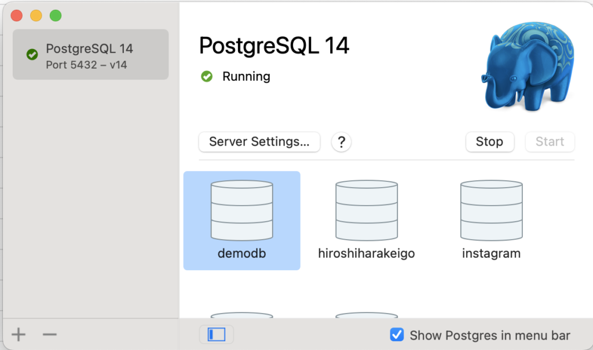
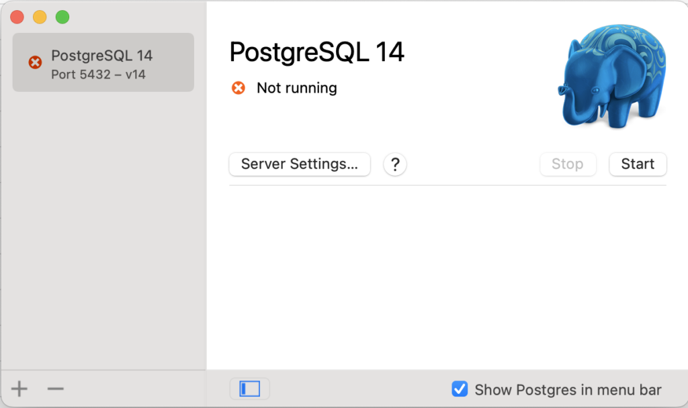
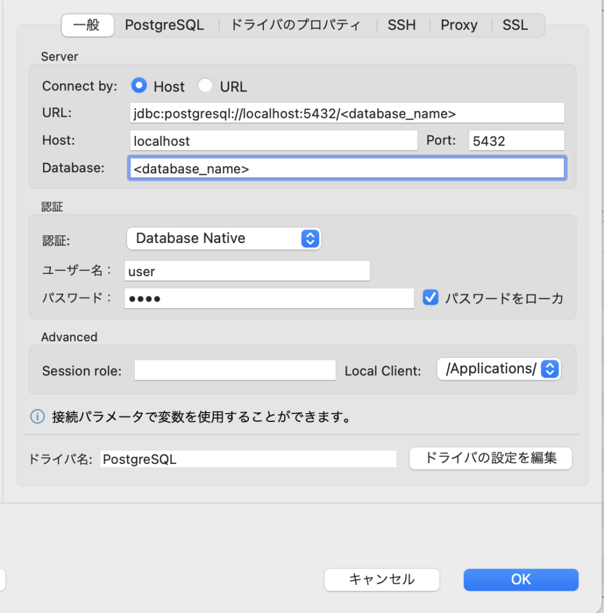

こんにちは、今回はPostgreSQLの開発環境をDockerで構築する方法についてまとめていきたいと思います。

自分もDocker初心者なので、参考程度に見ていってください。

## 事前準備

開発環境の構築前に確認することがあるので、見ていきましょう。

### ローカルのPostgreSQLをシャットダウンする

※既にローカル上にPostgreSQLをインストールしている方への内容です。

まずローカル上のPostgreSQLを止めていきましょう。



上のように「**Running**」と表示されていると思います。

今PostgreSQLが起動している状態なので、「**Stop**」ボタンを押してシャットダウンしていきましょう。



上の画像のように、「**Not running**」と表示されていればOKです！

なぜPostgreSQLを切る必要があるのでしょうか？

それはローカル上でPostgreSQLが動いていると、Dockerコンテナで起動しているPostgreSQLと競合してサーバーやクライアントと接続できなくなってしまうからです。

接続がうまくいかない場合には再度シャットダウンされているか確認しましょう。

アプリを終了するとPostgreSQLが自動的に起動してしまうので、終了せず開いたままにしておいてくださいね。

### ファイル構成

```
.
├── README.md
├── .env
├── docker-compose.yml
└── postgresql
    └── init
        └─ init.sql
```

## 環境構築

それでは、実際に構築していきましょう。

### データベースの初期化コマンドを作成

まず、データベースを作成するコマンドを作成していきます。

/postgresql/init/init.sqlに下記のコマンドを入力していきましょう。

```
CREATE USER <user_name>;

CREATE DATABASE <database_name>;

GRANT ALL PRIVILEGES ON DATABASE <database_name> TO <user_name>;　//ユーザーがDBの操作をできるように権限を付与 

\c <database_name>
```

### 環境変数の設定

次に、データベースの作成に必要な認証情報を記述していきます。

.envファイルに、下記の内容を記述してください

```
POSTGRES_USER=user
POSTGRES_PASSWORD=pass
```

### Dockerコンテナの設定を記述

次にDockerのコンテナを走らせるための設定を記述していきます。

docker-compose.ymlを記述していきましょう。

```
version: '3'
services:
  postgresql:
    container_name: postgresql
    image: postgres:14.0-alpine
    ports:
      - 5432:5432
    volumes:
      - ./postgresql/init:/docker-entrypoint-initdb.d
    environment:
      POSTGRES_USER: "${POSTGRES_USER}"
      POSTGRES_PASSWORD: "${POSTGRES_PASSWORD}"
    restart: always
```

これで、環境構築の準備が整いました！

### コンテナの起動

作成したdocker-compose.ymlから、コンテナを走らせていきましょう！

```
docker-compose up -d
```

## DBクライアントと接続

最後に、作成したPostgreSQLコンテナとDBクライアントを接続していきましょう。

クライアントツールは色々とありますが、今回はBDeaverを使っていきます。

https://dbeaver.io/



DBeaverにて、

Host: localhost

Port: 5432

Database: Dockerfileにて設定したdatabase\_name

ユーザー名: user

パスワード: pass

を入力することで、接続ができます。

## Dockerを使うメリット

さて一連の構築手順が完了したわけですが、なぜわざわざDockerを使う必要があるのでしょうか？

見ていきましょう。

### ローカルでPostgreSQLをインストールする必要がない

まず、 Dockerは仮想環境を提供してくれるソフトウェアです。

0からローカル上に環境を構築しようとなると、手間やコストがかかってしまいます。

一方、Dockerはコンテナを走らせるコマンドを実行すれば、すぐに開発環境を用意することができます。

手間やコストを削減することができるので、積極的に使っていきたいですね(^^)

### 開発環境を統一できる

開発環境を簡単に構築できるというのもメリットですが、コンテナを用意することによって開発環境を統一できるというもの大きなメリットです。

チームで開発しようとなったとき

Aさんは 既に環境構築が完了しているが、Bさんはまだ言語のインストールさえできていない。

といった事態を防ぐことができるので、開発に集中することができます。

自分ももっとDockerを自由自在に扱えるように頑張っていきます(^^)
