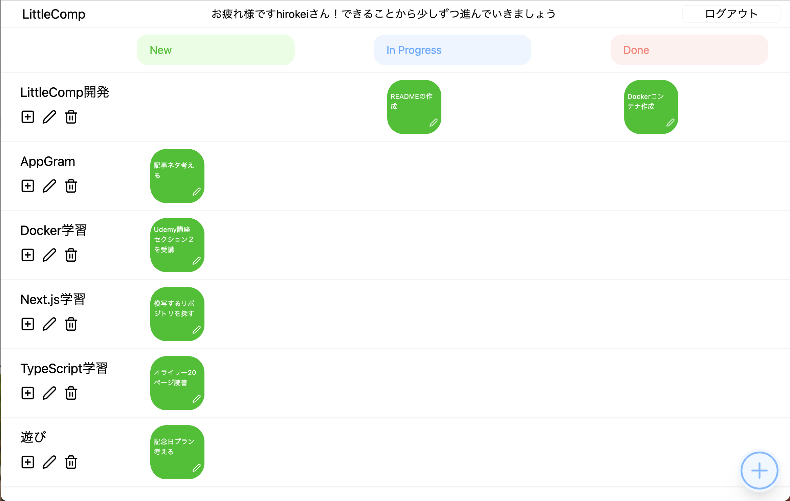
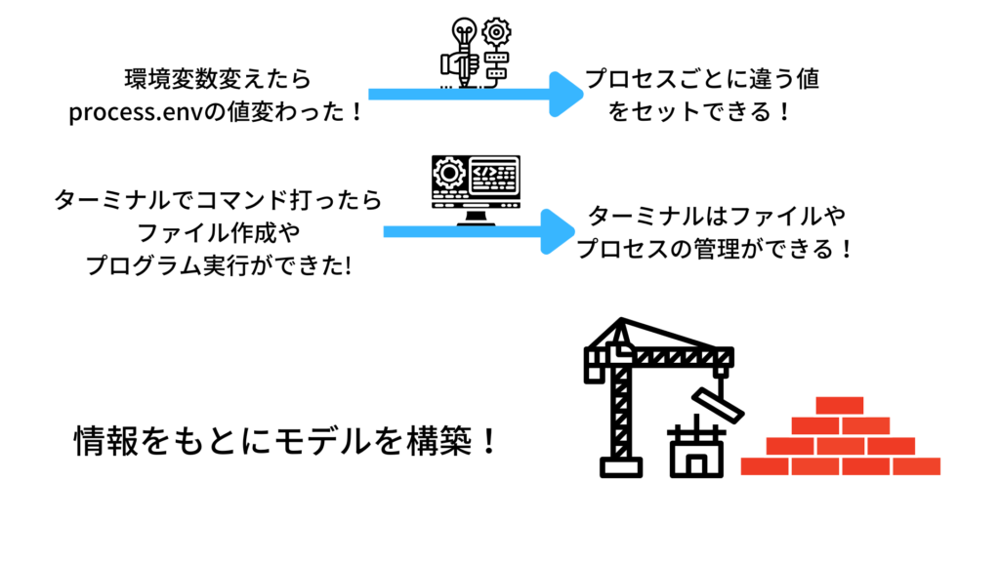

こんにちは。

最近は新しい技術を学習する機会が多く学びの質や早さを改善したいと思い、「[エンジニアの知的生産術](https://www.amazon.co.jp/%E3%82%A8%E3%83%B3%E3%82%B8%E3%83%8B%E3%82%A2%E3%81%AE%E7%9F%A5%E7%9A%84%E7%94%9F%E7%94%A3%E8%A1%93-%E2%80%95%E5%8A%B9%E7%8E%87%E7%9A%84%E3%81%AB%E5%AD%A6%E3%81%B3%E3%80%81%E6%95%B4%E7%90%86%E3%81%97%E3%80%81%E3%82%A2%E3%82%A6%E3%83%88%E3%83%97%E3%83%83%E3%83%88%E3%81%99%E3%82%8B-WEB-PRESS-plus-ebook/dp/B07JFRF6MW/ref=sr_1_1?adgrpid=53431906556&gclid=Cj0KCQiAgribBhDkARIsAASA5bs3cqkhIBLMj3PGoc14n2EVBWMuSibm9tDlhI9A17YzvpmLFIj1tY8aAouBEALw_wcB&hvadid=618552905697&hvdev=c&hvlocphy=9053413&hvnetw=g&hvqmt=e&hvrand=4589351190540574480&hvtargid=kwd-484598975701&hydadcr=27264_14598071&jp-ad-ap=0&keywords=%E3%82%A8%E3%83%B3%E3%82%B8%E3%83%8B%E3%82%A2%E3%81%AE%E7%9F%A5%E7%9A%84%E7%94%9F%E7%94%A3%E8%A1%93&qid=1668233632&qu=eyJxc2MiOiIxLjM0IiwicXNhIjoiMS4xMyIsInFzcCI6IjEuMDgifQ%3D%3D&sr=8-1)」という本を読みました。

仕事でも生活の中でも便利そうな内容だったので、有用な内容を要約しておこうと思います。

「新しい技術を学習したいけど、この方法で合ってるか迷う💦」

「やることがわからないし、そもそもやる気が出ないから行動できないよ。。。」

こんな方に読んで欲しい内容となっていますので、よろしくお願いします。

## タスクを書き出す

まず、自分のやるべきことを言語化し、Todoリストやタスクリストを作って書き出してみましょう。

### 内容は具体的かつ明確にする

タスクを作成する上で最重要になるのが、内容を明確にするということです。

明確にすることで、このタスクで何を達成すれば良いのかが明確になります。

例えば

```
NG: TypeScript学習をする
```

このタスクではタスク内容が抽象的で、何を達成すべきなのかを把握できません。

このタスクで基本的な環境構築方法について学習したいのかもしれませんし、はたまた型定義方法の種類を調べたいのかもしれません。

```
OK: TypeScriptにおいて、型推論される状況で明示的に型指定をする必要があるか調べる
```

これならこな内容が明確になってますし、ゴールも「型指定をする必要があるか否かを知る」というゴールが設定できています。

重要なのは、

- 内容が具体的であるか

- ゴールが明確であるか

です。この2点を意識してタスクを作成していきましょう。

### ゴールを時間で設定するのもアリ

もしあなたが「AWSのECRを使ってできることを知りたい」という状況だとしましょう。

そんな時、こんなタスクを作成するかもしれません。

```
ECRでできることを調べる
```

このタスクでは、内容が抽象的であるうえ、ゴールも明確に定まっていません。

しかし、未知の領域について学ぶ場合はゴールを明確に指定できないことが多いと思います。

そもそも自分が持っている情報源が少ない場合、知りたいことを明確に把握できないのはしょうがない事です。

ゴールを明確に設定できない場合は、時間をゴールにしてみましょう。

```
ECRでできることを調べる(30分間)
```

時間が設定されていれば明確なゴールが設定できているので、ダラダラとネットサーフィンに時間を費やすこともなくなりますね。

一旦このタスクをこなしてから、さらに内容を深く調べていくのか、実際に使ってみるのかを判断していきましょう。

### モチベが湧かなければ、タスクを分割すべきサイン

さぁ、タスクを作成し、いざ作業に取り掛かりましょう！

そんな時、頻繁にぶち当たる壁があります。

それは、モチベーションが湧かないことです。

原因としては、タスクの粒度が大きすぎるが為にゴールや自分のすべきことがイメージできていないことが多いです。

多くの場合はタスク分割で解消できます。

例えば、Reactでアプリを作成しているとします。

```
ユーザー関連の処理を実行できるカスタムフック：　「useUser」を作成する
```

仕様がまとまっていれば難なくこなせる人もいるでしょう。

しかし、「何から手をつけていけば良いか分からない」という人もいます。

実際自分は後者でした。

そんな場合は

```
ユーザーデータを取得するgetUser関数をuseUser内に作成する
```

```
ログインができるlogin関数をuseUser内に作成する
```

```
ログアウトができるlogout関数をuseUser内に作成する
```

タスクを分割していくことですべきことが明確になり、達成のイメージもつきやすくなるので、着手に対するハードルも下がると思います。

モチベ湧かなきゃタスク分割

合言葉ですので、覚えておきましょう！

### LittleCompを使ってタスク管理

現在、知的生産性を上げるためのタスク管理アプリを制作しています。ぜひご覧ください。



[LittleComp](https://github.com/hirokei-camel/LittleComp)

## 脳の仕組みを理解して学習効率を上げる

技術を学習しようとなった際、教材やリポジトリを使って学んでいくと思います。

そんな時、学んだ内容がどのように記憶され自分で使えるようになるかを把握しておくと、自分の理解度チェックにも役立ちます。

プロセスを見ていきましょう。

### 情報収集

まずは情報のインプットから始まります。

本や教材などで新しい情報が頭の中に入ってきます。

- チュートリアルでお手本通りに手を動かした経験

- ドキュメントを読んで分かったこと

- 他の人からもらった技術的アドバイス

頭の中に入ってきた情報は次のフェーズで変化していきます。


### 抽象化

新しい情報は既存の情報と比較されることで、頭の中でモデルとして構築されていきます。

「コマンドラインでコマンドを打ったら、プログラムを実行できたりファイルの作成ができた。つまり、コマンドとはプログラムやファイルの管理ができる物に違いないだろう。」

「環境変数で指定したデータベースURLを変えたら、違うデータベースと接続できた。ということは、環境変数はプロセスごとに違う値を設定できるものなんだな。」

自分の頭で考えるためには、事前に具体的な経験を得るが必要なのですね。



### 実践

抽象化によって構築されたモデルは、実践することで記憶として定着していきます。

実践の種類としては以下のようなものがあるでしょう。

- ポートフォリオの作成

- エンジニア業務

- 技術ブログの執筆

いずれも、自分で考えないとできないものばかりです。

ここで学んだ内容をうまく利用できていない場合、２パターンに分かれます。

分からない内容を言語化できている場合とできていない場合です。

できていない場合、情報収集の量が足りていない場合が多いです。

ですので、学んだ内容を今一度復習することが最善の策です。

できている場合は、分からない箇所をピンポイントで調べたり質問することで、解決できます。
