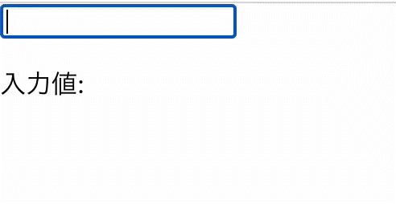
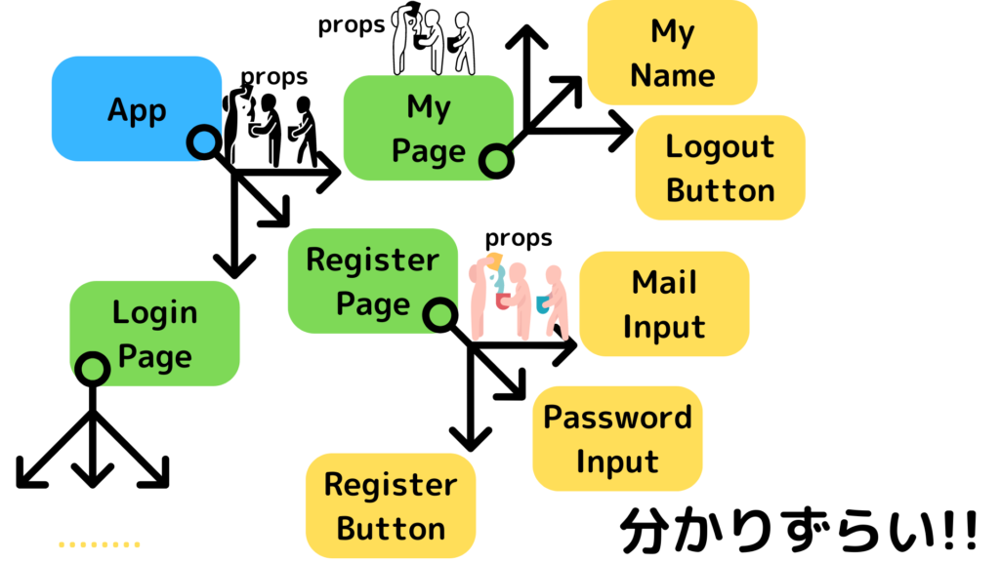
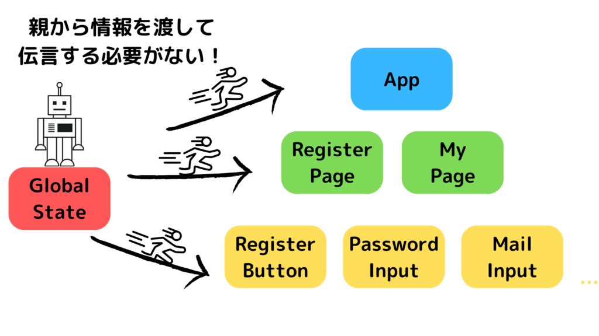

こんにちは！ヒロケイと申します。

皆さんはReactの状態管理方法としてどんな方法を使っていますか？

今回はLocal StateとGlobal Stateの違いについて触れつつ、様々な状態管理方法についてまとめていきたいと思います。

Reactを学習している方のお役に立てれば幸いです。

## Local Stateを使った状態管理

まず、Local Stateについて見ていきましょう。

Local Stateは、コンポーネント内で状態管理をするための手法です。

useStateを使った状態管理がまさにそれです。

Local Stateを使ったコードを見ていきましょう。

```
import { useState } from 'react';

function App() {
  const [inputValue, setInputValue] = useState('');
  return (
    <div>
      <input
        type="text"
        value={inputValue}
        onChange={(e) => setInputValue(e.target.value)}
      />
      <p>入力値: {inputValue}</p>
    </div>
  );
}

export default App;
```



こちらはinputを用意し、入力された値を表示するプログラムです。

- inputValue: 管理させたい値

- setInputValue: 値を更新させるときに使う関数

これら2つを使って

- input要素のonChange propにsetInputValueを設定(入力欄の更新とともに値も更新する)

- 表示するpタグ内にinputValueを表示させる

するようにしています。

### コンポーネントに分割する

次に、作成したプログラムをコンポーネントごとに分割していきましょう！


元々App.jsxだけだったプログラムをInput.jsxとDisplayLabel.jsxに分けていきます。

#### App.jsx

```
import { useState } from 'react';
import DisplayLabel from './DisplayLabel';
import Input from './Input';

function App() {
  const [inputValue, setInputValue] = useState('');
  return (
    <div>
      <Input inputValue={inputValue} setInputValue={setInputValue} />
      <DisplayLabel inputValue={inputValue} />
    </div>
  );
}

export default App;
```

新しくInputとDisplayLabelコンポーネントが配置されています。

それぞれのpropsにstateが渡され、inputValueとsetInputValueが設定されていますね。

#### Input.jsx

```
import React from 'react';

const Input = (props) => {
  return (
    <div>
      <input
        type="text"
        value={props.inputValue}
        onChange={(e) => props.setInputValue(e.target.value)}
      />
    </div>
  );
};

export default Input;
```

propsで渡ってきた値をinputタグの

- value→inputValue

- onChange→setInputValue

に設定することで、入力欄の更新に伴ってsetInputValueを実行できます。

その結果、App.jsxのinputValueが更新されるわけですね。

#### DisplayLabel.jsx

```
import React from 'react';

const DisplayLabel = (props) => {
  return <div>入力値: {props.inputValue}</div>;
};

export default DisplayLabel;
```

こちらも同様に、proosで渡ってきたinputValueを表示させていますね。

このようにLocal Stateを使ってコンポーネントを分割する際、情報のやり取りにpropsを使わなければなりません。

ページ全体の規模が大きくなり、分割するコンポーネントの階層や数が増えてくるとpropsのバケツリレーという事態を招くことになります。

propsのバケツリレーのデメリットとしては

- コードを読む際、propsで渡ってきた情報のソースを探す時に時間がかかる

- コンポーネントのpropsが増えてくるとコードが理解し辛くなる

こういった点で、propsのバケツリレーを行うのは開発現場では避けるべきとされています。



```
      <RegisterPage
        isLoggedIn={isLoggedIn}
        isValidPassword={isValid}
        isAdminUser={isAdmin}
        maxNameLength={10}
        minNameLength={10}
        maxPasswordLength={10}
        minPasswordLength={10}
      />
      <LoginPage
        isLoggedIn={isLoggedIn}
        isValidPassword={isValid}
        isAdminUser={isAdmin}
        maxNameLength={10}
        minNameLength={10}
        maxPasswordLength={10}
        minPasswordLength={10}
      />
      .......
      // コンポーネントが増えれば増えるほどpropsの数も膨大になってしまう。。。
```

## Global Stateを使った状態管理(Recoil)

それでは、propsのバケツリレーを解決するためにはどうすれば良いのでしょうか？

そのためには、情報を親からではなく他の何処かから直接持ってくる方法が一番でしょう。

その何処かがGlobal Stateです。

Global Stateとは、アプリ全体を管理するためにの状態管理手法です。

以下のような情報を格納しておくときに効力を発揮します。

- ユーザーがログインしているか？

- 管理者ユーザーか？

- 検索ページの入力内容

- 通知



Global Stateを取り入れる手段はさまざまなものがありますが、今回はRecoilを使ってコードを改善していきたいと思います。

公式ドキュメント: [https://recoiljs.org/docs/](https://recoiljs.org/docs/)

### App.jsx

```
import { RecoilRoot } from 'recoil';
import DisplayLabel from './DisplayLabel';
import Input from './Input';

function App() {
  return (
    <RecoilRoot> // RecoilRootでラップ
      <Input />
      <DisplayLabel />
    </RecoilRoot>
  );
}

export default App;
```

Recoilでの状態管理を導入するには、管理下に起きたいコンポーネントをRecoilRootでラップします。

アプリ全体を状態管理下におきたいので、App.jsx内をRecoilRootでラップしました。

またLocal Stateはもう使わないので削除し、propsには何も設定していない状態です。

### form.js (New!)

```
import { atom } from 'recoil';

export const formState = atom({ // atom ≒ useState
  key: 'formState',
  default: '',
});
```

次に、管理したい状態を宣言します。

Recoilで状態を宣言する際には、atom()を使います。

Local Stateで言うところのuseState()と似ていますね。

- key: ユニークな文字列を設定。管理する状態のタイトルのようなもの

- default: 初期値を設定する。文字列以外にもIntやBooleanも可

### Input.jsx

```
import React from 'react';
import { useRecoilState } from 'recoil';
import { formState } from './form';

const Input = () => {
  const [inputValue, setInputValue] = useRecoilState(formState); // 引数には先ほど宣言したformState
  return (
    <div>
      <input
        type="text"
        value={inputValue}
        onChange={(e) => setInputValue(e.target.value)}
      />
    </div>
  );
};

export default Input;
```

設定したGlobal Stateを使ってInput.jsxを改良していきましょう。

useRecoilStateを使ってformStateにアクセスします。

使い方は基本的にuseStateと同じなので、valueやonChangeに指定している記述はすぐ理解できると思います。

- value: 管理下の状態

- onChange: 状態を更新する関数

### DisplayLabel.jsx

```
import React from 'react';
import { useRecoilState } from 'recoil';
import { formState } from './form';

const DisplayLabel = () => {
  const [inputValue] = useRecoilState(formState); // Input.jsxと同様の呼び出し
  return <div>入力値: {inputValue}</div>;
};

export default DisplayLabel;
```

Displaylabelに関してはsetInputValueを呼び出していません。(使わないため)

#### 両者の違い、使い分け

Local State, Global Stateに関して簡単に触れてきました。

Global Stateはとても便利ですが、管理する情報全てをGlobalにするべきではないです。

管理する情報によっては、一つのコンポーネント内でしか明らかに使わないようなものも存在します。

そういった管理対象がコンポーネント内で完結している状態はuseState(Local State)を使うようにしましょう。

## 様々なGlobal State管理方法

### SWR

SWRは元々データフェッチのためのライブラリです。

しかし、ある応用をすることでGlobal Stateとして使うことができるようになります。。。！

```
const { data, error } = useSWR('key', null, { initialData: 'light' });
// 第２引数(フェッチ関数)をnullにすることで、Global Stateとして応用できる！
```

参考になった記事

- [https://weseek.co.jp/tech/2565/](https://weseek.co.jp/tech/2565/)

- [https://zenn.dev/itizawa/articles/9f71e1f636d3d2](https://zenn.dev/itizawa/articles/9f71e1f636d3d2)

### Redux

ReduxはGlobal Stateの管理方法としてはメジャーなものです。

書き方や基本の理解に少々時間がかかるかもしれませんが、採用している会社も多いので学んでおいて損はないと思いますよ！

[


参考

Redux - A predictable state container for JavaScript apps. | Redux


](https://redux.js.org/)

## まとめ

最後まで読んでいただき、ありがとうございました。

Reactに限らず、こちらの記事ではNode.jsの理解を深められる講座を紹介しています。

[


参考

【新人エンジニアが選ぶ】受講してよかった講座ランキング3選

AppGram


](https://app-gram-kei.com/?p=528)
