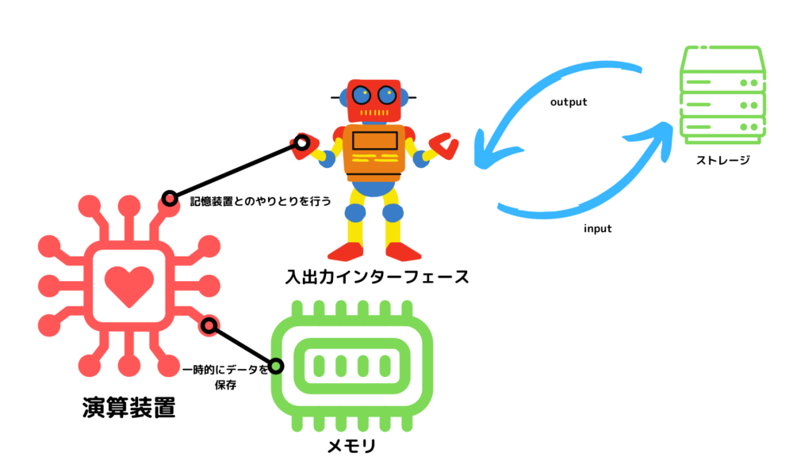
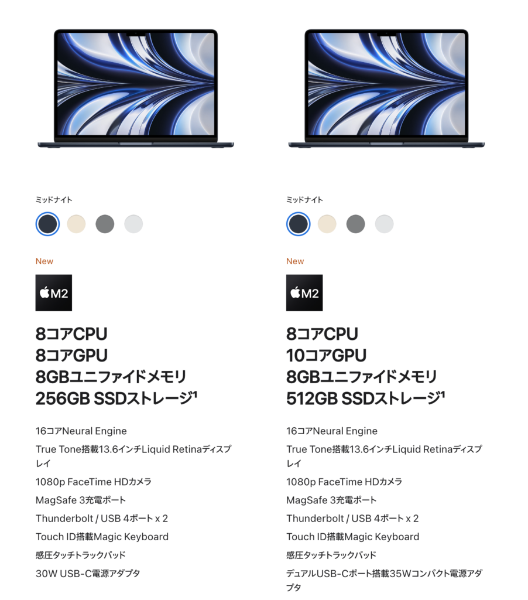

## パソコンの構成要素

パソコンは、主に4つの機構で成り立っているんだ。

- プロセッサ

- メモリ

- ストレージ

- ネットワーク

今回はプロセッサの処理性能について見ていこう。

## プロセッサ

プロセッサは

- 演算装置

- メモリ

- 入出力インターフェース

の3つで構成されている。

皆が聞いたことがある「CPU」もプロセッサだな。

構成要素について一つずつ見ていこう。

### 演算装置

プロセッサの中核とも言える、演算装置について見ていこうか。

「コア」とも呼ばれているよ。

プログラムの実行や演算の処理を行ってくれるんだ。

### メモリ

メモリは演算装置が処理を行うための一時的なデータの保存領域として使われているよ。

一時的に保存しておくので、キャッシュの役割を果たしてくれているんだ。

繰り返し使いたいプログラムやデータを一時的に保存しておけば、同じ処理を何回も行わなくて済むからね。

### 入出力インターフェース

入出力インターフェースはプロセッサ外の記憶装置とやり取りをするための機構だ。

プロセッサだけだと記憶できるデータの量が非常に少ないから、他の領域にデータを保存しておく必要があるんだ。

以上がプロセッサの基本構造だよ。

各要素の関係を把握しておくと良いな。

## プロセッサの処理の流れ

プロセッサの構造を理解したので、処理の流れについてみていこうか。

1. 実行するプログラムの読み込み

3. 実行しやすい形にプログラムを変換(デコード)

5. 演算対象データの読み込み

7. 演算

9. 演算結果のを記憶装置へ出力

これらの処理全体の速さが、プロセッサの処理速度になってくるよ。

実は1, 3のような読み込みの際、一度実行したプログラムやデータをプロセッサのメモリに保存しておくことで処理を高速化しているんだ。

## 処理を高速化

さて、プロセッサの処理を高速化するためにはどうすれば良いのだろうか？

皆はどんな案が浮かぶだろうか？

- プロセッサ自体の処理を高速化

- プロセッサを複数用意して処理を同時進行させる

主にこの2つがあるよ。順番にみていこう。

### プロセッサ自体の命令の実行速度を速くすれば良いのでは？

まず一つ目に、プロセッサの処理性能を高速化していく策についてみていこう。

パソコンは情報を0と1で処理しているって聞いたことないかな?

その通りで、プロセッサも0と1で情報を処理しているんだ。

ビットと呼ばれる単位で表されるから覚えておいてな。

この0と1を表す電気信号の切り替えの速さ「クロック周波数」によって命令の実行速度が決まってくるよ。

クロック周波数によってプロセッサの命令実行速度が変わってくる。ここ大事！

なら、クロック周波数を大きくすることで処理を高速化できるのではないかな？

そうも単純でなくてな。。。

クロック周波数を上げると、

- 発熱がひどくなる

- 消費電力が上がってバッテリー劣化を早める

こういった問題を発生させてしまうんだ。

こういった状況から、クロック周波数で処理を高速化する工夫は2002年頃に終わったんだって！

つまり将来性薄

### 処理を同時進行させるのはどうだろう？

プロセッサ自体の処理速度をあげる策が無くなった。

次は同時進行で処理を進める工夫についてみていこう。

10分かかる処理を2つのプロセッサに分けて行えば、2倍の速度になるんじゃね？って作戦だ。

手段としては

- PC内のプロセッサを複数用意する「マルチプロセッサ」

- プロセッサ内のコアを複数用意する「マルチコア」

この2つがある。

プロセッサだけでなく、それぞれのコアも複数用意することで更なる高速化を図れるね。

現在の処理高速化はこの方法が主流になっているよ。

## パソコンのスペックを見て処理速度を確認してみよう！

さあ、実際のPCのスペックを見てプロセッサやコアがいくつ搭載されているかを見てみよう。

[Apple](https://www.apple.com/jp/shop/buy-mac/macbook-air)のmacbook air販売ページでは

こんな表記がある。

マルチプロセッサの表記はないから、一つのプロセッサに8つの演算装置が搭載されているんだね。

ん？GPU?なんだそりゃ。

次で解説しよう。

## 特定の処理に秀でたプロセッサがある。。。！

プロセッサの中には、特定の処理に特化したものがあるんだ。

GPUと呼ばれる映像や画像のリアルタイム処理に秀でたプロセッサがあるよ。

映像処理に強いから、ゲーミングパソコンに搭載されていることが多いね。

最近のMacBookにも搭載されてきているよ
