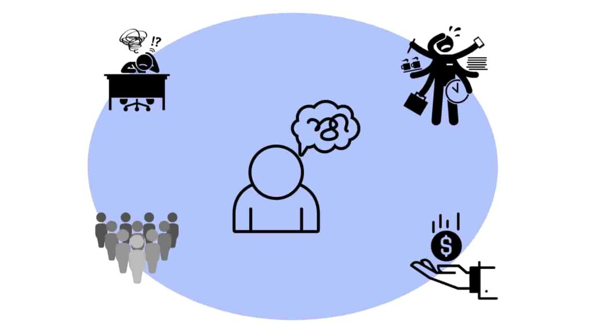
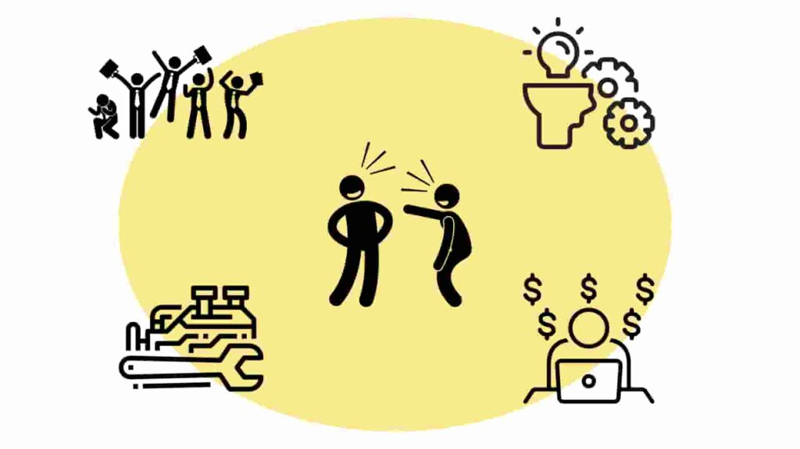

こんにちは、ヒロケイです。

このページでは、プログラミングを勉強することのメリットデメリットについて解説して行きます。

- プログラミングで稼げるって本当なの？

- 最近流行ってるけど、何が良いの？

このような疑問を持つ方は多いですよね。

一緒に解決して行きましょう。

## **デメリット**

まず、デメリットについて一つずつ見ていきましょう。

- 習得するのに結構な時間が必要

- 苦戦しても助けてくれる人がいない

- 分野や内容によっては高価なパソコンが必要

- ある程度のレベルになるまでがハード

## まとまった勉強時間が必要

プログラミングを学習するとなると、基本を身につけるのに長い時間がかかります。

個人によって向き不向きや状況が違うので、具体的に何時間かかるというように提示することはできませんが、自分は基本を身につけるのに「270時間」かかりました。(一日3時間勉強を3ヶ月継続)

高校生や大学生は時間が余りがちな期間なので、学習するのに絶好のチャンスと言えるでしょう！

deno

興味はあるけど、忙しくてあまり時間が取れそうにないな。。。

bot

最初のうちは一日1時間程でも問題無いよ！

継続さえすれば大丈夫！

また、稼ぐことだけを目的にすると絶対に続かないことを覚えておいてください！

「生活習慣を改善したいから、そのために体調管理アプリを作りたい！そのためにプログラミングを勉強しよう！」という具合で、プログラミングを手段として勉強するんだという認識で勉強する必要があります。

(ちょこっと勉強すれば簡単に稼げるものという認識で勉強すると100パーセント途中で諦めます。)

## **わからなくなった時、自己解決する必要がある**

自力で本や教材を買って独学で勉強するとなると、途中で以下のような壁が立ちはだかります。

- どうしても原因が解らないエラー

- いくら考えても浮かばない機能の実現手段

こういった状況に遭遇すると、挫折という結果を迎えます。

いくら考えても解決できない時でさえ、自力で解決する必要があります。

先生やメンターに教えてもらえる環境にいればこの問題はないですが、完全独学で学習するとなると、苦戦する機会が多いでしょう。

deno

身近にプログラミングを教えてくれる人がいると、モチベーションの維持にもなりそう！

bot

間違いない！

メンターを雇ったり、スクールに通ったりするのも手段の一つとしては有効だな。

## **ある程度のスペックを備えたパソコンが必要**

プログラミングを勉強するには、当然パソコンが必要になってきます。

すでに自分のPCを持っているよという方は特に問題はないですが、新しくパソコンを買う場合は少し気をつけるべきことがあります。

プログラミングにはさまざまな分野があります。

- Web開発

- データ分析

- 機械学習

- PCやスマホのアプリ開発

将来的にデータ分析や機械学習をやりたいと思っている方は多量のデータ処理時の負荷が大きいのでGPUを搭載したPC、Web開発やアプリ開発に興味がある人はサーバーを起動する機会があるので、16GB以上のメモリを持つPCという具合で、ある程度のスペックが必要になってきます。

大体ですが、十数万円程度のPCが用意できれば安心ですね。

deno

初期投資がかかってしまうのは痛いな。。。

bot

最初の出費は頑張る必要があるけど、これ以外に大きな出費は無いから頑張るしかない！w

## 一定のスキルレベルになるまでは結構ハード

プログラミングは稼げると聞いた方も多いでしょう。

事実ではありますが、もう少し厳密に言うと

一定期間の実務経験を経た技術力のあるエンジニアは不足しているから、その人たちは引く手数多だから稼げる

プログラミング未経験の人が1, 2年勉強しても、年収1000万を達成するのは現実的では無いのです。。。

厳しいですね💦

高収入やフリーランスになって活動するには、数年の実務経験に加え、個人で学習を続ける必要があります。

deno

フリーランスエンジニアってよく聞くけど、経験豊富な人が自発的に仕事したいって人がやっているのか！

bot

インフルエンサーたちが発信している内容を見ると、楽して稼げるという印象

に見えるかもしれないね！

最初は無給の状態で1, 2年ほど学習する必要がありますが、勉強して開発の知識がついてきた段階で月10万円ほどの収入を得るチャンスが出てくるでしょう。

そこまで勉強し続ける忍耐力が必要ですね。

deno

経験ゼロからスタートすると、やはり無給の期間を経験せざるを得ないのか！

bot

最初の数ヶ月は修行の時期だね！

このブログ「[AppGram](https://app-gram-kei.com/)」はそんな修行の時期の人たちが稼げるまでに役立つ情報を発信しているよ！

## **メリット**

一方、プログラミングを勉強するメリットは以下のようなものがあります。

- 身につけたスキルを駆使して稼ぐことができる

- プロセス立てて考える思考力が養われる

- 自分で好きなものを作れる

- 楽しい

## **稼げる**

プログラミングを駆使して他人に価値を提供できるレベルまで勉強すれば、お金を稼げるようになります。

- エンジニアとして転職、就職

- 学生ならばインターン生として活動する

- クラウドソーシングサイトで仕事を受注

これらの方法で稼ぐことができます。

また、技術系の職は「知識集約型」という特徴があります。

勉強した内容を業務に生かしたり業務での経験が年収アップにつながりやすいので、稼ぐための学習にかかる時間のコスパが非常に良いのです！

deno

ヒロケイはどうやって稼いでいるんだ？

bot

僕はエンジニアインターンとしてIT企業で勤務をしているよ！

経験を積む第２の修行期って感じだな。

## **論理的思考力、問題解決能力が身に付く**

プログラミングを学習することで、論理的思考力を磨き上げることができます。

- こうしたらどうだろう？

- エラーを解決するためには何が必要なのだろうか？

課題をシンプルにして体系的に理解する力が養われるので、結果的に問題解決能力やコミュニケーション能力が向上していくのです。

結果的に稼げなくても勉強するだけでこういった思考力が向上していくので、趣味だけでもやる価値は十二分にあります。

実際「物事をプロセス立てて試行錯誤しながら問題解決する」経験をさせるため、義務教育にもプログラミングが取り入れられたのは有名ですね。

[

参考

プログラミング教育とは？必修化された目的や内容、問題点を解説 | 私学の教員採用・求人情報なら教員人材センター

私学の教員採用・求人情報なら教員人材センター -

](https://kyoin.co.jp/column/programming-education/)

bot

ある程度の論理的思考力が身についたから、友達にプログラミングを教えるのも楽しくなっちゃいましたw

## **自分で欲しいと思った物を作れる**

生活や仕事で「こんなものがあったら良いな」と思ったものを作れるのもメリットですね。

こんなサービスあったら良いな

- タスクリスト

- せどりのリサーチツール

- 仕事で使うツールを自動化して業務効率化できるツール

- PDCA日報の記録サイト などなど

せどりのリサーチツールやデータの収集プログラムは、実際に販売することもできたりします。

自分で「欲しい！」と思ったものは、大抵他の人も欲しいと思っているもの。

作ったサービスを販売する個人開発なんかも面白そうですよね！

deno

Facebookを作ったマークザッカーバーグとかも、自分で作った経験があるって聞いたことがある！

bot

そうだね！自分があったら嬉しいと思うものを作って起業した人は世の中にたくさんいるんだ！

[

参考

TOP | NEWTYPE-DELTATRACER

NEWTYPE-DELTATRACER

](https://www.new-deltatracer.com/)

## 楽しい ※重要

何といってもこれにつきます。

プログラミングってとっても楽しいんです！

- 試行錯誤しながらものを作る時の没頭感

- 工夫して組んだコードが思い通りに動いてくれた時の達成感

- 新しい技術を学ぶときのワクワク感

正しい方法で勉強すれば、コードを書くのが楽しくなっちゃって止まらないなんてこともザラにありますw

deno

そんな没頭するくらい楽しいの？

全然イメージがわかないよ。。。

bot

プログラミングの楽しさはやってみないと体験できないんだ。。。

みんなにもこの快感を感じてほしいぜw

## まとめ

メリットデメリット両方を加味して、プログラミングは勉強するべきだと僕は思います。

自分がプログラミングについて興味を持ってから仕事に採用されるまでを以下の記事でまとめていますので、是非読んでみてください。

最後まで読んでくださり、ありがとうございました。
