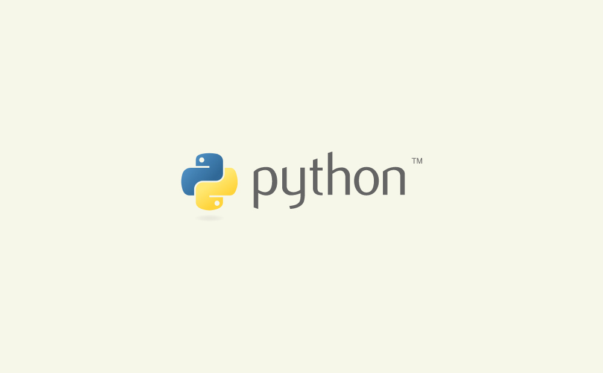
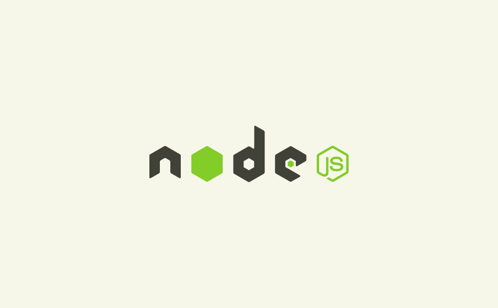
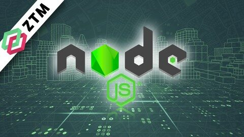
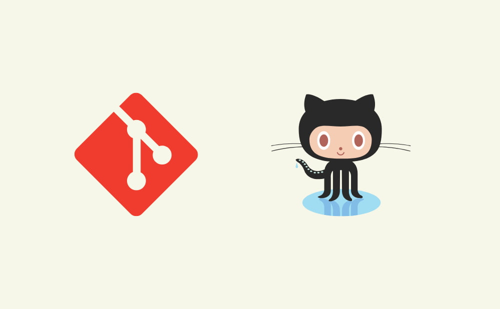
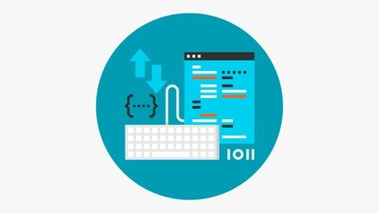

みなさんこんにちは！

今回は、現役エンジニアである筆者が実際に受講して良かった講座ランキングをお伝えします。

- Udemyでたくさんの」講座があるけど、どれが自分の難易度に合っているかがわからない

- 有料だから、身につかない講座は買いたくない

こんなこと思いますよね！

bot

自分の難易度に合っているかって、分かりずらいですよね💦

この記事を読むことで

- ごまんとあるUdemy講座の中から特に優良な講座が分かる

- 学習しやすい「優良講座がある」プログラミング言語が分かる

それでは、やっていきましょう！

## 【1位】100 Days of Code: The Complete Python Pro Bootcamp

私がプログラミングを学習してきた中で一番良かったと思う講座は、[100 Days of Code: The Complete Python Pro Bootcamp](https://www.udemy.com/course/100-days-of-code/?utm_source=aff-campaign&LSNPUBID=UFVArvevc4I&utm_medium=udemyads&ranMID=47984&ranSiteID=UFVArvevc4I-P_R3r33YANi7xasXbvYUbw)

です。

こちらはPythonの講座で、100日間毎日講座を受講してプログラミングを学習するといった講座です。

Pythonの基本文法から始まり、環境構築やライブラリを用いたGUIやゲームの制作を通して、自分の作りたいものを作ることができるレベルまで学習することができます。

おすすめポイントは以下です。

- プログラミングの楽しさを教えてくれる

- 完全初心者でも取り組める敷居の低さ

- 毎日続けても無理のない講座時間

- エンジニアにとって重要なマインドを経験を通して学べる

- 自分で考えてコードを書く形式なので、身につく早さが段違い

- 英語の表現がシンプルで分かりやすいので、聞いているだけでも内容を理解できる

[

参考

100 Days of Code: The Complete Python Pro Bootcamp for 2023

Udemy

](https://click.linksynergy.com/deeplink?id=UFVArvevc4I&mid=47984&murl=https%3A%2F%2Fwww.udemy.com%2Fcourse%2F100-days-of-code%2F)

この講座をおすすめする人

- プログラミング初心者で、これから稼ごうと思っている人

- まずはプログラミングの楽しみながらステップアップしていきたい人

- 学生や本業をする傍ら、時間を削りながら学習する人

bot

Python以外でも役に立つマインドも学習できたので、やっておいてよかったと思う講座でした(^^)

## 【2位】Complete NodeJS Developer

自分が学習してきた教材で、最も力になった教材があります。

それは、[Complete NodeJS Developer](https://www.udemy.com/course/complete-nodejs-developer-zero-to-mastery/?utm_medium=udemyads&ranSiteID=UFVArvevc4I-hmoDJotsVgfaXdYd1CVSjA&ranMID=47984&utm_source=aff-campaign&LSNPUBID=UFVArvevc4I)です。

サーバー側でJavaScriptを動かしながら

- パフォーマンスの向上

- アプリの公開

- ソケット通信

- 単体テストの書き方

- インフラの構築

などについて学んでいきます。

プログラミングというよりかは、Webエンジニアになるために必要な知識をハンズオンで学んでいく形式です。

痒い所に手が届いている講座ですね！

この講座のおすすめポイントは以下です。

- サーバー開発を学習するにはこれ以上ない程の内容の濃さ

- サーバーだけでなくインフラ周りの知識も身につくので、講座をやり切れば自分でポートフォリオを作れるようになる

- 英語がゆっくりなので、内容をスラスラ理解できる

- HTML, CSS, JavaScriptの基礎知識が必要になる

[

参考

Complete NodeJS Developer in 2023 (GraphQL, MongoDB, + more)

Udemy

](https://click.linksynergy.com/deeplink?id=UFVArvevc4I&mid=47984&murl=https%3A%2F%2Fwww.udemy.com%2Fcourse%2Fcomplete-nodejs-developer-zero-to-mastery%2F)

この講座をおすすめする人

- 一通りプログラミングについての基礎はついている

- Webエンジニアになりたい

- Webサービスを作るための全体像を把握したい

bot

この講の内容を把握していれば、web開発系の企業に参入するための基礎が身につきます。

## 【3位】Git： もう怖くないGit！チーム開発で必要なGitを完全マスター

エンジニアとして開発業務をするにあたって、絶対に使うシステムがあります。

それは、Gitです。ソースコードを管理するために必要なのですが、

- ソースコードを共有して他の人に見てもらう

- 共有しているソースコードでアプリをリリースする

などのことができます。

Gitを抑えておかないと、ほとんどの会社では相手にしてもらえないでしょう。

求人の説明欄では、「Githubに何かしらのアウトプットを挙げている」ことを条件にしているとことが多いです。

そんなGitなのですが、こちらの講座がとても役に立ちました。

おすすめの理由としては、覚えたい内容以外はとことん削ぎ落としてあるので前提知識が必要ない点です。

人によって、学習してい言語が違うでしょう。JavaScriptを学習してる人もいれば、PHP、Java。。。

ソースコードの管理をするためにそういった言語の前提知識が必要とされている講座が多い中、この講座は必要なこと以外を削ぎ落としたシンプルな内容なので学習しやすいです。

[

参考

Git： もう怖くないGit！チーム開発で必要なGitを完全マスター

Udemy

](https://click.linksynergy.com/deeplink?id=UFVArvevc4I&mid=47984&murl=https%3A%2F%2Fwww.udemy.com%2Fcourse%2Funscared_git%2F)

この講座をお勧めする人

- 一通り開発に必要な知識を学んだ人

- エンジニアになりたい人

## まとめ

Udemyは一つの技術についてハンズオンで学習していくので、内容を体系的に理解できます。

プログラミングで稼ぐ入り口の一つとして、Udemyは非常におすすめです。

最後まで読んでくださり、ありがとうございました。

当ブログでは、プログラミングについて興味を持った人が収入を得るるまでに役立つ知識を発信しています。

ぜひご覧ください。

[

参考

トップ

AppGram

](https://app-gram-kei.com/)
