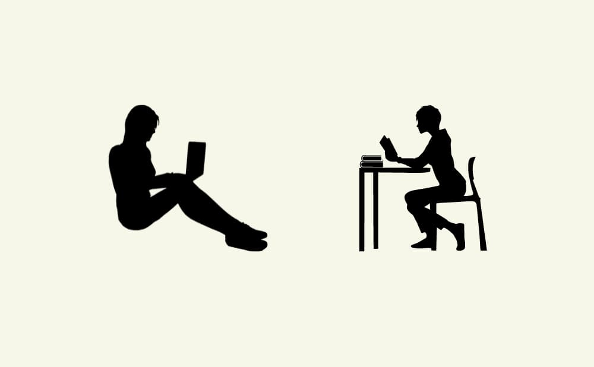
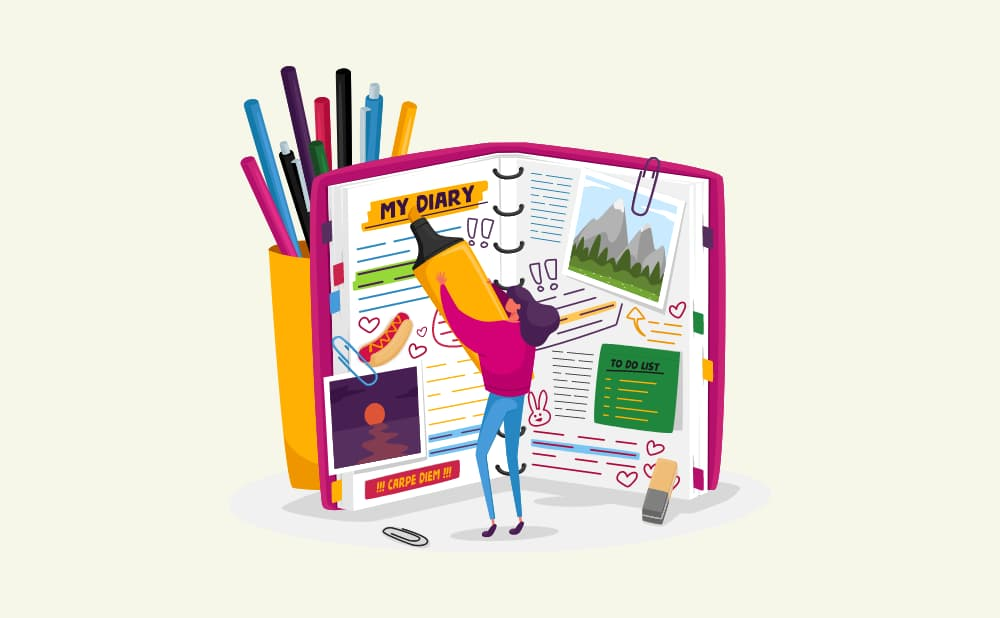

こんにちは！ヒロケイです。

今回は、毎日やりたいことに全力で取り組むために必要なことについて紹介します。

こんな悩みをお持ちの方、いらっしゃるのではないでしょうか？

- 特に悩みがあるわけではないが、なぜか平日の朝は気分が落ちる

- 会社に行くのがだるい、とにかく会社に行きたくない

- 日曜の夜が憂鬱、明日のことを考えるだけ嫌な気持ちになる

誰もが一度は経験する感情だと思います。

自分も同じような憂鬱な感情に陥り、仕事に意欲的に取り組めなくなってしまう時期がありました。

bot

活躍や成長をしたいとは思ってるけど、周りの人と同じスピードで結果が出ずに

何度も挫折した経験が自分にもあります。。。

この記事を読むことで

- 朝の憂鬱な感情とおさらばできる

- 毎日イキイキと能動的に過ごせるようになる

- 圧倒的な自己成長を遂げることができる

会社で活躍できる人間になりたい、自分の中でやり遂げたいことがある。

このような願望を持つ人ほど効果を発揮するテクニックをまとめましたので、ぜひご覧ください。

## 夜、寝る前の30分であることをする

結論から言うと、毎日の憂鬱感を無くし意欲的に過ごすための方法は以下の2つを続けることです。

- 振り返り日記を書く

- 翌日にやることをまとめる

deno

え！なんだよそんなつまらないことで解決なんてできるのかよ。。。

bot

そうなんだよ！僕も最初はこんなことでうまくいくのか不安だったんだ。

でもやっていくうちに、効果を感じるようになったんだよ！

意外に当たり前なことすぎて、失望したかもしれませんねw

しかし、これら二つのことを意識して毎日続ければ、自分を圧倒的に成長させることができます。

それぞれの内容について、詳しく見ていきましょう。

### 朝、憂鬱に感じる原因

そもそも、なぜか朝に憂鬱感を感じる原因はなんなのでしょうか？

それは、以下のような不安から発生している可能性が高いです。

- 会社や学校で何をすれば良いかよくわからない

- とりあえず出勤時間だから会社に行ってるけど、意欲的に取り組んだ経験がないから仕事がつまらない

- 自分が仕事でやり遂げたことに実感を持てないので、会社で除け者扱いされていないか心配だ

人間、先が読めない状態になると不安になるものです。

~~

もしかしたら、今日は上司に怒られるかもしれない。

怒られたら、自分の評価が下がるんじゃないか？

そしたら仕事を振ってもらえなくなるかも。。。

あぁ~~~~~

先の読めない状態になると、人間の脳はネガティブな情報に注意を向けやすくなります。

ネガティビティバイアスという人間の脳の性質なので、これは仕方がないんですよ。。。

Point

人間はネガティブな方法に考えてしまう生き物。

憂鬱な気分になるのはごく自然なことなんだと受け入れよう。

このような「今日一日何が起こるかわからない」という不安を取り除く方法として、今から2つのことを紹介します。

## 日記を書く

まず、日記を書いていきましょう。

日記には何を書けば良い？

- 1日の振り返りをする

- 良かったこと、または続けたいと思ったことを記録する

- ここが改善点だ、もっと良くしたい！と思ったことを記録する

### 1日の振り返り

基本的に、その日に思ったことをなんでも書いて大丈夫です。

- 朝起きた時間

- 朝食の味

- 午前中に起きた嬉しいこと

- 最近の体調

- 午後からの眠気　　　　などなど。。。

大事なのは、自分の思っていることを言葉にすること。

自分の頭の中を言語化するメリットとして、ストレス解消や語彙力向上、副交感神経が優利になるなど、メリットがたくさんあります。

### ここが良かった！

1日の行動で自分が「ここ良かった！」「翌日はこれも続けていきたい！」と思うことを箇条書きでまとめていきましょう。

- 朝寝坊せずに起きれた

- オナニーを我慢できた

- ブログ１記事更新できた

- 仕事で~~を終わらせた

- 隙間時間に本を読めた　　　などなど。。。

大事なのは、自分を褒めてあげること。

自分には当たり前だと思ってても、他人から見たらすごいことだっていっぱいあります。

bot

読書を毎日続けていることでも、側から見たらすごいことですよね！

実は、あなたにはすごいことがいっぱい隠れているんです✨

自分のポジティブな面を意識することで、簡単に自己肯定感をあげることができます。

そして、自己肯定感は自信につながります。

### ここ改善したい！

逆に、1日の行動のうち「ここができなかった。」「ここはもっと改善できそう」と思ったことを箇条書きでまとめていきましょう。

- ブログの記事、結構おろそかな記事になってしまったから、次は情報収集の量を多くしよう

- 誘惑に負けてSNSをいじってしまったから、スマホを視界から外してみよう

- 昼ご飯食べすぎて午後眠気がすごかったから、昼のご飯の量は少なめにしてみよう

- 食事中に映画を見るとキリがなくずっと見てしまうから、見るのはやめよう　　　　　　　　などなど。。。

大事なのは、その日で見つけた課題と解決策を自分なりに考えてみること。

もちろん、「自分は一日できること全てできたから文句なしの日だった」「今日は特に改善点はないな」と思った日は書かなくても大丈夫ですよ(^^)

まとめた改善点を、翌日に解消できるよう過ごしてみましょう！

## 翌日にやることを箇条書きする

さぁ、次に翌日にやるタスクリストを作っていきましょう。

「Todoリスト」とも言われています！

ここで意識すべき点は、1, 2時間程で達成できるレベルまで分割することです。

タスクの粒度が小さい点に関しては問題ないです。

しかしタスクが大きいと、「何から始めれば良いの？」と不安の原因となってしまいます。

最初のうちはできるだけ具体的、かつ細かくタスクを組んでいきましょう。

- ブログ記事書く
    - ネタについて下調べする
    
    - 記事構成考える
    
    - 本文書く
    
    - 推敲
    
    - 装飾する
    
    - 投稿

- 仕事
    - メールのチェックする
    
    - ミーティングに参加する
        - 気になってた~~~の件を聞いてみる
    
    - \~~~を片付ける

- 家族
    - 帰りに豚肉とキャベツ買ってく

- などなど。。。

もちろん、翌日のやることがわからない場合は「その日にやることを考える」自体をタスクにしても良いでしょう。

## まとめ

今回紹介した方法を実践することで、翌日のやることが明確化され、仕事や勉強へのモチベーションが向上していくことでしょう。

あなたはRPGの勇者の如く、見積もったタスクというモンスターを倒していくことで自分の目指す姿へと成長していきます。

なぜこんなに自信を持っておすすめできるのかというと、ある概念に基づいているからです。

PDCAサイクルという考え方に基づいていて

- Plan: 翌日のタスクをまとめる

- Do: 1日を過ごす

- Check: 日記を書く

- Action: 改善できそうなところを見つける

ちょうど今回のメソッドと密接な関係ができています。

そして今回紹介したメソッドの効果を感じるためには、毎日続けることが大切です。

1日だけでもそれなりの効果を感じられるものですが、圧倒的な自己成長を実現するためには毎日欠かさず続けていくことが最も大切です！

また、仕事や勉強をする環境を整えることで、作業の効率を何倍にもあげることができます。

詳しくは、こちらをご覧ください。

[

参考

自宅での仕事や勉強で集中できるようになるグッズ4選

AppGram

](https://app-gram-kei.com/?p=575)

最後まで読んでいただき、ありがとうございました！

## １週間続けても、まだ憂鬱感が抜けない場合は

今回紹介した方法を試してみても何も効果がない。。。

憂鬱感が抜けないし、むしろ悪化しているかも。

そう感じた場合、疲労が溜まっている可能性があります。

放っておくと、自律神経失調症やうつ病などの病気を患ってしまう可能性があります。そんな時は、一度仕事や勉強から離れて遊ぶことをおすすめします。
