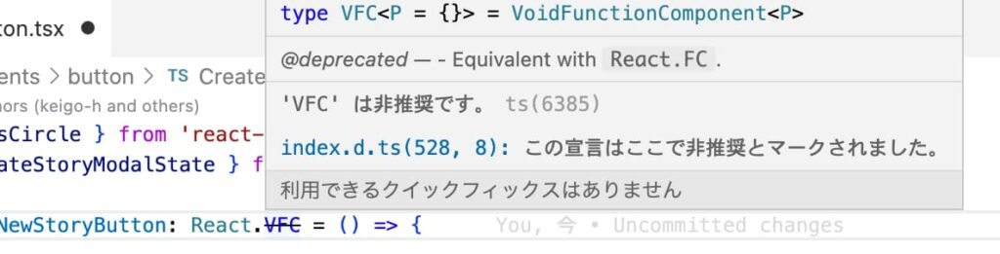
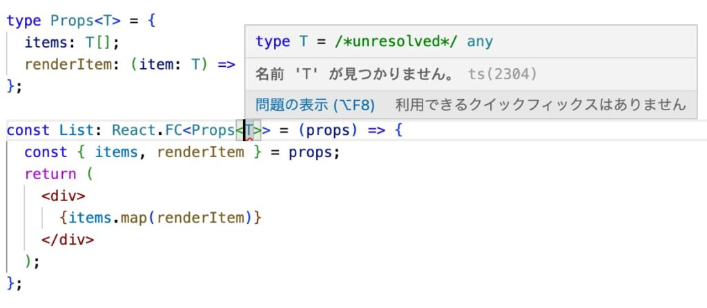

こんにちは、ヒロケイです。

今回は、Reactにおけるコンポーネントの型定義についての話をしようと思います。

- JSX.Element, FC, VFCどれを使えば良いの？

- それぞれどんな特徴があるのだろうか。

PRの参考や、モヤモヤの解消に役立てれば幸いです(^^)

## 結論

とりあえず

JSX.Element、またはReact.FCを使おう。

React.VFCは使ってはいけない！

このようになっています。


deno

なぜにReact.VFCは使っていけないの？


bot

バージョンの事情でReact.VFCは非推奨になっているんだ。

それぞれの型の特徴を見ていこう！

## FCとVFCの違い

Reactで用意されている型定義の違いについて見ていきましょう。

(読みやすさのため、省略してあります。)

### FCの型定義(node\_module下にあるファイル)

```
type FC<P = {}> = FunctionComponent<P>;

interface FunctionComponent<P = {}> {
    (props: PropsWithChildren<P>, context?: any): ReactElement<any, any> | null;
}
```

### VFCの型定義(node\_module下にあるファイル)

```
type VFC<P = {}> = VoidFunctionComponent<P>;

interface VoidFunctionComponent<P = {}> {
    (props: P, context?: any): ReactElement<any, any> | null;
//          ↑ここがPropsWithChildren<P>からPになっているだけ 
```

### Propsにコンポーネント型を設定するかで違いが出る

上記二つの型定義の違いは、propsに渡す型がちょびっと違う程度でしたね。

では、その違いについて掘り下げてみましょう。

二つの型で違いが出るのは、Propsにコンポーネントを指定するときです。

React.FCで指定した場合↓

```
export const Layout: React.FC = ({ children }) => {
  return <div>{children}</div>;
};
```

React.VFCで指定した場合↓

```
export const Layout: React.VFC<{ children: React.ReactNode }> = ({ children }) => {
  return <div>{children}</div>;
};
```

どちらも定義しているコンポーネントの機能は変わりませんが、React.VFCの場合はジェネリクスにPropsの型を明示的に指定する必要があります。

一方、React.FCはPropsにchildrenの型を指定しなくてもPropsを設定できます。


bot

明示的に指定しなくてもchildrenを指定できることから、暗黙のchildrenと言われています

### React.VFCは使うべきではない

元々はReactではFCしか無かったのですが、暗黙のchildren型を許してしまうと、必要の無い型が含まれてしまうという指摘からReact.VFCが生まれました。([VFCが登場したPR](https://github.com/DefinitelyTyped/DefinitelyTyped/pull/46643))

しかし、Reactのバージョンが18になってから型定義が大きく変わってきます。

React.FCが暗黙のchildrenを許さなくなったのです。

つまり、React.FCがReact.VFCと同じ型定義になったわけです。

そうすると、React.VFCはもう必要なくなります。


bot

同じ型を二つ用意している必要はないからね！

その結果、v18では、React.VFCを指定するとnotationが表示されます。



プロジェクトのpackage.jsonでdependenciesに格納されているReactのバージョンを確認してみると良いですね(^^)

## JSX.ElementとFCの違い

次に、React.FCとJSX.Elementの違いについてみていきましょう！

### JSX.Elementはジェネリックコンポーネントが使える

JSX.Elementは、様々な型に対応するジェネリックコンポーネントに対応しています。

```
interface Props<T> {
  items: T[];
  renderItem: (item: T) => ReactNode;
}

const List = <T,>(props: Props<T>): JSX.Element => {
  const { items, renderItem } = props;
  return <div>{items.map(renderItem)}</div>;
};
```

引数の型にジェネリック型を用意することで、PropsにstringやObjectを代入しても機能する汎用的なコンポーネントを作ることができます。

```
function App() {
  return (
    <>
      <List
        items={['hirokei', 'deno', 'bot']}
        renderItem={(item) => <p>{item}</p>}
      />
      <List
        items={[
          { name: 'mickey', position: 'leader' },
          { name: 'minnie', position: 'designer' },
          { name: 'walt', position: 'ceo' },
        ]}
        renderItem={(user) => (
          <>
            <h1>{user.name}</h1>
            <p>{user.position}</p>
          </>
        )}
      />
    </>
  );
}
```

これは、React.FCではできない使い方ですね(^^)

何故なら、コールバック関数外で型指定をするために具体的な型を指定する必要があるからです。



### 型指定方法が違う

```
type Props = {
  title: string;
  description: string;
};

export const Card: React.FC<Props> = ({ title, description }) => {
  return (
    <div>
      <h2>{title}</h2>
      <p>{description}</p>
    </div>
  );
};
```

```
type Props = {
  title: string;
  description: string;
};

export const Card = ({ title, description }: Props): JSX.Element => {
  return (
    <div>
      <h2>{title}</h2>
      <p>{description}</p>
    </div>
  );
};
```

JSX.Elementでは、コールバック関数内で型を指定する必要があります。

Propsの型指定方法に関して、React.FCでは型指定をした際にジェネリクスの中にPropsの型を指定できます。

一方、JSX.Elementは引数内に直接指定する必要があります。

### 型定義にはどんな違いがあるの？

React.FCとJSX.Elementでは、型定義にどんな違いがあるのかをみていきましょう！

```
namespace JSX {
        interface Element extends React.ReactElement<any, any> { }
```

```
type FC<P = {}> = FunctionComponent<P>;

interface FunctionComponent<P = {}> {
    (props: PropsWithChildren<P>, context?: any): ReactElement<any, any> | null;
}
```

主な違い

- React.FC: コールバック関数が返した結果がReact.ReactElement

- JSX.Element: ReactElementを拡張した空オブジェクト

型定義上ではそんなに大きな違いがないことがわかりますね！

## まとめ

まとめとして、

- JSX.ElementかReact.FCを使おう！

- どちらを使うかは既存コンポーネントの型指定に従ってOK

- VFCはこれから非推奨だからNG

このような結果になりました。

最後まで読んでいただき、ありがとうございました。
