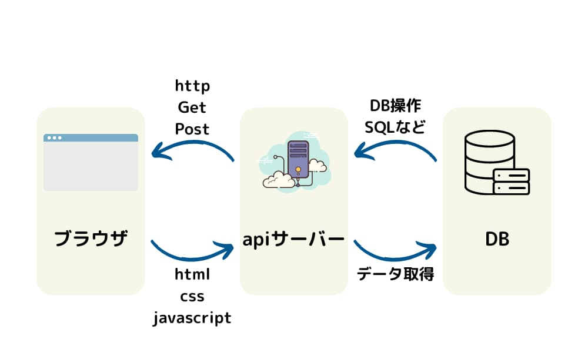
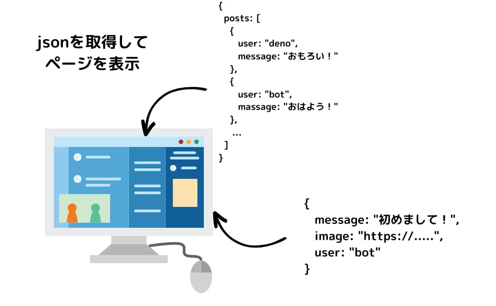
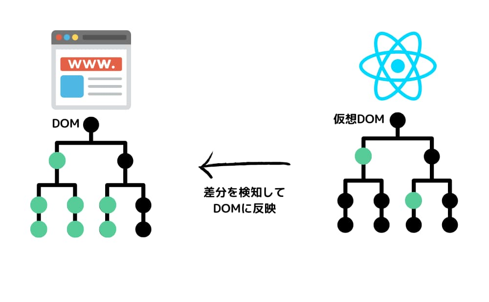

こんにちは！ヒロケイです。

最近のフロントエンド開発では良くReactが使われるようになりましたね！


deno

Reactの仕組みを調べたいけど  
どこから手をつければ良いか分からないよ。。。


bot

とりあえず動けばOK！で学習してきた人から

ステップアップしていきましょう(^^)

想定読者

- React学習歴1ヶ月~1年の初学者

- `npm run start`したらとりあえずReactを起動できた

- とりあえずコンポーネント分割と状態管理ができるライブラリという認識

仕組みやバックグラウンドを理解することで、体系的な理解をしていきましょう！

この記事を読むメリット

- Reactが登場した背景や仕組みについて分かる

- SSRやCSRなど、レンダリング方法の違いやSEO対策の基礎知識がつく

- フロントエンドの全体的な構造を体系的に学べる

## React登場の背景

### React登場以前のフロントエンド (~2000年)


Reactが登場する前のWebページは、apiサーバーから生成されたHTMLが直接Webブラウザに表示される形式が主流でした。

静的なHTMLファイルが表示されるので、データの変更などが合ってもリロードをしなければ反映されない状態です。

ページを移動するたびにapiサーバーへHTMLファイルを要求する必要があり、UXが悪いなどのデメリットがありました。



### Ajaxの登場により、SPAが普及(2000~2010年頃)



2000年頃になり、Ajax(エイジャックス)と呼ばれるプログラミング方式が登場しました。

Ajaxって？

簡単にいうと、ページの表示と同時進行でjsを動かすことができる仕組み。

画面表示と同時進行でjsを動かすことにより、サーバーから取得したjsonデータをブラウザ上のhtmlに反映させることが可能になる。

結果、ブラウザのページの一部を動的に切り替えることができるようになる。

ex)

- 検索エンジン(文字を打つと自動で表示されるサジェスト)

- 地図アプリ(ページの一部を更新できるので、スワイプした先に表示すべきマップ情報を取得できる)

- SNS(タイムラインをスクロールすると、画面戦せずに投稿を読み込める)

ページ全体ではなく一部だけを更新することができるので、データを更新するごとにページ遷移する必要がないのが大きなメリットですね！

Ajaxについての詳しい登場背景は[Wikipedia](https://ja.wikipedia.org/wiki/Ajax)を参照ください。

### SPAを構築できるフレームワーク、Reactが登場！(2011年)

Ajaxが登場したことで、高頻度で画面遷移をする必要がなくなった頃、新しい課題が出てきました。

Ajaxの課題

実際に表示したいデータとDOMの整合性が取れない

サーバーから取得したデータをDOMへ反映させる必要が出てきました。

その結果jsのコードが複雑になってしまう問題が出現しました。

そんなコードの複雑さを解消するため、Facebookがあるライブラリを公開しました。

それがReactです。

ReactはDOMと取得データを同期させる手段として、仮想DOMというアプローチを取りました。

また、ReactはDOMとデータの生合成をとるだけでなく、SPAという通信方式を採用しました。

SPAってなんぞや？

Single Page Applicationの略。

名前の通り、サイト全体をページ一枚でやりくりしていこうぜというニュアンスでOK。

ページの初回アクセス時にHTMLを返した後は、画面遷移をせずにページの一部HTMLのみ取得していく通信方式

ex)

ログイン→マイページの画面切り替えも、apiサーバーから丸ごとページのHTMLを取得することなく切り替えできる

仮想DOMについては後の仕組み解説にて詳しく紹介します。

## Reactが画面を更新する仕組み

### Reactは仮想DOMライブラリ

先ほど登場した仮想DOMについて詳しく見ていきましょう！

仮想DOMとは？

ブラウザの表示に使われているDOMの構成を真似したオブジェクト。

名前にDOMと付いているが、直接ブラウザに表示されているオブジェクトではない。

形は至って普通のJavaScriptオブジェクト。

仮想DOMの一部の更新を検知し、DOMと同期させることで、その差分のみを検知することができます。

その結果、ページ単位でも要素単位でもページ遷移することなく画面切り替えができるようになりました。



### 仮想DOMをどうやってブラウザのDOMに反映させる。。。？

仮想DOMとDOMの同期はどのようにして実現しているのでしょうか？

ReactDOMというライブラリを使用することで、実現できます。

```
ReactDOM.render(
    <App/>
, document.getElementById('root'));
```

Reactコンポーネントの最上層で上記のような記述をすることで、ReactDOMとDOMの整合性をとっています。

## まとめ

今回は、Reactの登場背景と画面への描画方法を紹介しました。

当ブログでは、エンジニアインターンとして活動する大学生がテック系の記事を中心に扱っています。

エンジニアの知的生産生を上げる方法についてまとめていますで、よければご覧ください。

[


参考

AppGram｜プログラミングスキルを習得して稼ぐ力を身につけよう

AppGram


](https://app-gram-kei.com/?post=279)
