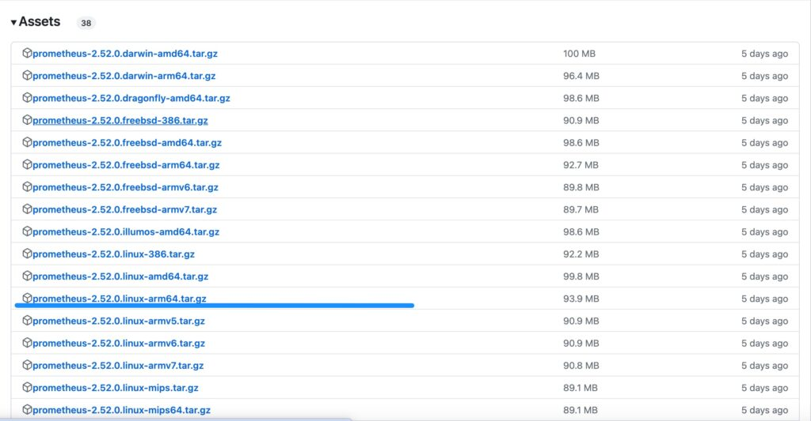

## こんな人向け

- SREとして勉強し始めた

- モニタリングとは何かを手を動かしながら学びたい

## この記事を読むとわかること

- Prometheusの環境構築方法を実際に手を動かしながら学べる

- パフォーマンスチューニングの前提である、負荷の計測手法を学べる

## Prometheusを準備、起動

[


参考

Releases · prometheus/prometheus

GitHub


](https://github.com/prometheus/prometheus/releases)

prometheusを動かす環境のcpuアーキテクチャに合ったアーカイブファイルのリンクをコピーします。



監視対象のLinux上にて、コピーしたファイルのコピーをwgetコマンドで取得します。

```
$ wget https://github.com/prometheus/prometheus/releases/download/v2.52.0/prometheus-2.52.0.linux-arm64.tar.gz

// zipファイルを展開して動作確認
$ tar zxvf ./prometheus-2.52.0.linux-arm64.tar.gz
$ cd ./prometheus-2.52.0.linux-arm64
```

prometheusが正常に動いていれば、下記通りの出力が表示されます。

```
$ ./prometheus --version
prometheus, version 2.52.0 (branch: HEAD, revision: 879d80922a227c37df502e7315fad8ceb10a986d)
  build user:       root@1b4f4c206e41
  build date:       20240508-21:59:01
  go version:       go1.22.3
  platform:         linux/arm64
  tags:             netgo,builtinassets,stringlabels
```

次に、監視対象サーバーのipアドレスを追加します。

まずはipアドレスを調べていきましょう。

```
$ hostname -I
182.169.66.13
```

インストールされたprometheusを確認すると、以下のようなファイル構成になっています。

```
$ ls
LICENSE  console_libraries  data        prometheus.yml
NOTICE   consoles           prometheus  promtool
```

prometheus.ymlを開き、以下のように修正します。

```
global:
  scrape_interval: 15s
  evaluation_interval: 15s

scrape_configs:
  - job_name: "prometheus"
    static_configs:
      - targets: ["182.169.66.13:9090"]
```

これで、監視対象サーバーの設定が完了し、起動の準備が整いました。

では、実際にPrometheusを起動してみましょう。

```
$ ./prometheus
ts=2024-05-12T23:21:00.238Z caller=main.go:573 level=info msg="No time or size retention was set so using the default time retention" duration=15d
ts=2024-05-12T23:21:00.238Z caller=main.go:617 level=info msg="Starting Prometheus Server" mode=server version="(version=2.52.0, branch=HEAD, revision=879d80922a227c37df502e7315fad8ceb10a986d)"
ts=2024-05-12T23:21:00.238Z caller=main.go:622 level=info build_context="(go=go1.22.3, platform=linux/arm64, user=root@1b4f4c206e41, date=20240508-21:59:01, tags=netgo,builtinassets,stringlabels)"
ts=2024-05-12T23:21:00.238Z caller=main.go:623 level=info host_details="(Linux 5.15.0-105-generic #115-Ubuntu SMP Mon Apr 15 09:52:04 UTC 2024 aarch64 performance-demo (none))"
```

しかしこの状態では、まだサーバーの負荷情報を取得することはできません。

次にNode\_Exporterの準備をしていきましょう

## 【エージェント】Node\_Exporterを準備、起動

監視対象サーバーにNode\_Exporterを追加していきます。

下記のページから、自分の監視対象サーバーにあったアーカイブファイルを取得します。

[


参考

GitHub - prometheus/node\_exporter: Exporter for machine metrics

GitHub


](https://github.com/prometheus/node_exporter)

```
$ wget https://github.com/prometheus/node_exporter/releases/download/v1.8.0/node_exporter-1.8.0.linux-arm64.tar.gz

// zipファイルを展開して動作確認
$ tar node_exporter-1.8.0.linux-arm64.tar.gz
```

次に、node\_exporterを起動してサーバーの負荷情報を取得できるようにしていきます。

prometheus.ymlにnode\_exporterの情報を追加していきます。

```
global:
  scrape_interval: 15s
  evaluation_interval: 15s

scrape_configs:
  - job_name: "prometheus"
    static_configs:
      - targets: ["182.169.66.13:9090"]

  - job_name: 'node'
    static_configs:
    - targets: ['182.169.66.13:9100']
```

node\_exporterを実行すれば、設定完了です。

```
$ ./node_exporter
```

ブラウザにてhttp://182.169.66.13:9090にアクセスすると、prometheusの画面が出てきます
